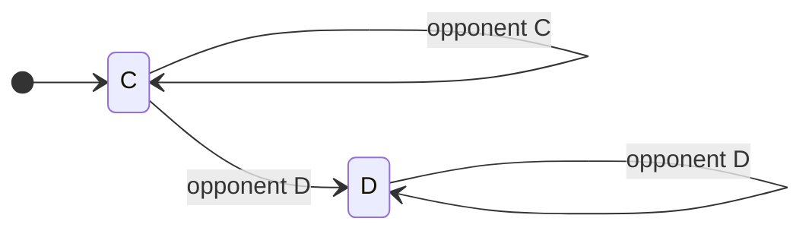
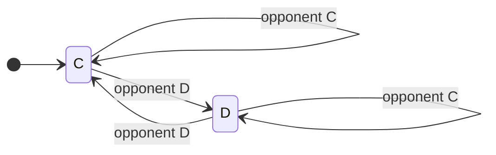
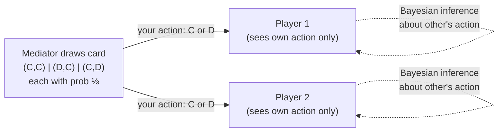
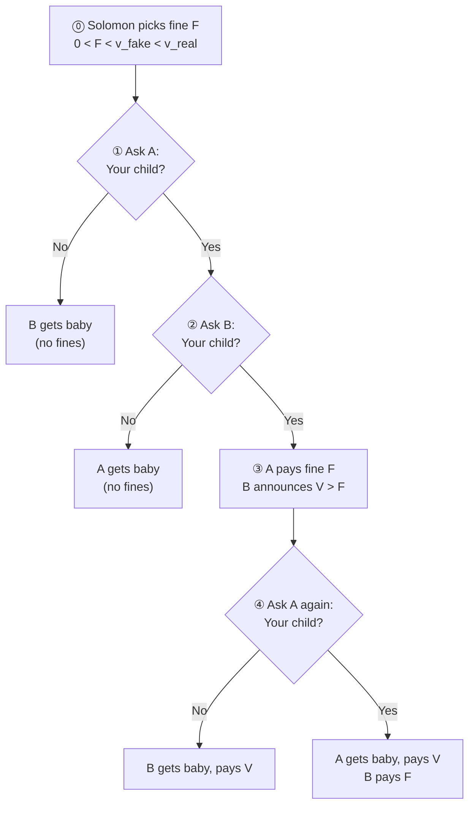
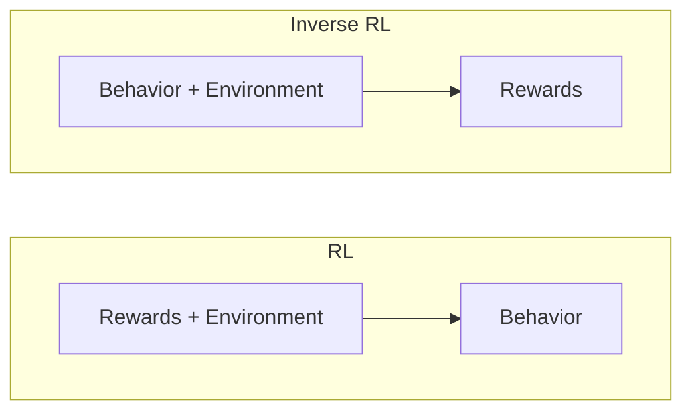
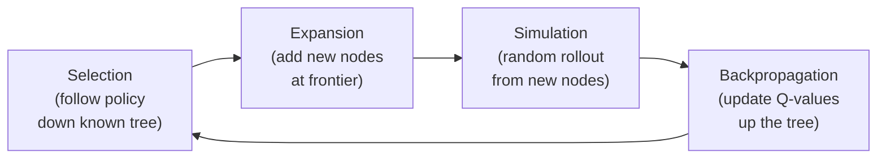

## Part 1: Reinforcement Learning Foundations

> *RL is a fundamental science trying to understand the optimal way to make decisions.*
>
> *A large part of the human brain / behavior is linked to a dopamine system (reward system), this neurotransmitter dopamine reflects exactly on one of the main algorithms we apply in RL.*
{: .prompt-info }

### 1a. Introduction to Reinforcement Learning

This course expands on the RL mini-course from the Machine Learning class, going deeper into both **theory** and **practice** of reinforcement learning.

#### Theory
- Convergence of RL algorithms
- Convergence rates and sample complexity
- Bounds on mistakes before convergence
- Situations where convergence fails

#### Practice & Topics Covered
- **Temporal Difference Learning** (TD Lambda)
- **Reward Shaping:** expressing goals via reward functions; the sole communication channel with RL algorithms
- **Generalization & Scaling:** tying into abstraction
- **POMDPs:** decision-making under partial observability
- **Options Framework:** temporal abstraction in RL
- **Monte Carlo Methods**
- **Game Theory:** solution concepts beyond Nash equilibria (e.g. correlated equilibrium)

### [Supplementary] Introduction to Reinforcement Learning

#### Where RL Fits in AI

> **Artificial Intelligence:** the ability of machines to simulate human behavior.
{: .prompt-info }

AI encompasses many subfields: planning (GPS navigation, resource allocation), knowledge-based AI (expert systems for medical diagnosis, teaching, etc.), machine learning, computer vision, robotics, and more. As these technologies mature, they often stop being perceived as "AI" and become just software.

**Machine Learning** narrows this down: simulating human behavior *by learning from data* (as opposed to planning, which uses clever algorithms without a data-learning requirement). ML has three main branches:

- **Supervised Learning:** learn from labeled data (input-output pairs) to generalize to unseen examples (e.g. image classification)
- **Unsupervised Learning:** learn structure from unlabeled data (e.g. clustering)
- **Reinforcement Learning:** learn to make *optimal decisions* through interaction with an environment

> The key insight: supervised/unsupervised learning help you *perceive* (classify, cluster), but ultimately what you care about is *acting optimally* based on those perceptions. RL directly addresses the decision-making problem.
{: .prompt-tip }

#### What Makes RL Different

RL is characterized by three types of feedback *(Littman, Nature 2015)*:

| | Supervised ML | Tabular RL | Deep RL |
|---|---|---|---|
| **Sequential** | No (one-shot) | Yes | Yes |
| **Evaluative** | No (supervised) | Yes | Yes |
| **Sampled** | Yes | No (exhaustive) | Yes |

##### 1. Sequential Feedback
Actions determine not just immediate outcomes but have **long-term consequences**. The agent must learn to balance immediate and long-term goals.

This gives rise to the **credit assignment problem:** when a reward is received many steps after the actions that caused it, which actions deserve credit?

> **Example:** A robot navigating to a goal has two paths. Path A starts with $-1$ but leads into $-100$. Path B has repeated $-10$ steps but lower total cost. The optimal choice depends on the *entire sequence*, not individual steps.
{: .prompt-tip }

##### 2. Evaluative Feedback
Rewards are *relative*, not *supervisory*. The environment doesn't tell the agent what the correct action is; it only provides a scalar signal indicating how well the agent is doing.

- You don't know the maximum achievable reward
- You must balance **exploration** (improving your estimates by trying new things) vs **exploitation** (acting on your current best estimates)

{: w="500"}

##### 3. Sampled Feedback
The agent cannot experience every possible state. It must **generalize** from limited experience to draw conclusions about states/actions it hasn't encountered.

{: w="500"}

> **Example:** An Atari game frame is $210 \times 160 \times 3$ pixels, each in $[0, 255]$. The state space is astronomically large ($\approx 10^{242,000}$), impossible to exhaustively explore. The agent must generalize.
{: .prompt-tip }

> **Course Structure Note:** In Assignment 1 (value iteration / policy iteration), the MDP is given, so evaluative and sampled feedback are relaxed: you solve for the exact optimal policy. In Part 2 (Q-learning, SARSA), evaluative feedback is introduced (explore vs exploit), but state/action spaces remain discrete (exhaustive). Later, all three feedback types are present.
{: .prompt-warning }

#### Deep Reinforcement Learning

Deep RL uses **multi-layer non-linear function approximators** (typically deep neural networks) within the RL loop. The network can approximate different components:

- **Policy-based RL:** network maps observations $\rightarrow$ actions
- **Value-based RL:** network approximates value functions
- **Model-based RL:** network approximates the environment dynamics, enabling planning

#### Multi-Agent Reinforcement Learning

Standard RL assumes a stationary environment. When **other learning agents** are present:
- The environment becomes non-stationary (other agents change their policies)
- Strategies that work against one opponent behavior may fail when the opponent adapts
- Requires specialized algorithms for coordination, competition, and human-AI collaboration

> **Course Note:** Project 3 involves implementing multi-agent scenarios with independent learners, each with their own neural networks, operating in a shared environment.
{: .prompt-warning }

#### RL Success Stories

| Domain | System | Key Achievement |
|---|---|---|
| Board Games | **AlphaGo** / **AlphaGo Zero** / **AlphaZero** | Defeated world champion at Go; AlphaZero learns from scratch without human data |
| Video Games | **AlphaStar** (DeepMind) | Grandmaster-level StarCraft II |
| Video Games | **OpenAI Five** | Defeated professional Dota 2 teams |
| Locomotion | **PPO** (OpenAI, 2016) | Same algorithm learns locomotion across different simulated bodies |
| Robotics | **Sergey Levine (Berkeley)** | Camera-to-robotic-control manipulation |
| Robotics | **OpenAI Dactyl** | Robotic hand solves Rubik's cube-like block manipulation |
| Infrastructure | **DeepMind Data Center Cooling** | Live production system reducing energy consumption |
| Navigation | **DeepMind Loon** | RL-controlled stratospheric balloons riding wind currents |
| Aerospace | **Alpha Dogfight Trials** (Lockheed Martin) | Defeated human fighter pilot (with truth state information) |
| Science | **AlphaFold** (DeepMind) | Protein structure prediction |
| Racing | **GT Sophy** (Sony AI) | Best Gran Turismo drivers; deployed on PlayStation |
| NLP | **ChatGPT** (OpenAI) | RLHF phase uses reinforcement learning |
| Mathematics | **AlphaProof** (DeepMind, 2024) | 28/42 points at International Mathematical Olympiad (silver medal level) |

#### Key Takeaway

> *"If a machine is expected to be infallible, it cannot also be intelligent."* : Alan Turing
>
> Intelligence is about trial and error, making decisions under uncertainty, learning from mistakes, and accurately estimating outcomes. This course is about exactly that.
{: .prompt-info }

### 1b. Smoov & Curly's Bogus Journey
> Note: This section includes additional content from Supplementary Lectures on MDPs & Planning Methods 
{: .prompt-info}

This is the mathematical heart of Part 1: we formalize the decision-making problem as an MDP, derive the Bellman equation, and develop algorithms (value iteration, policy iteration) to solve it. Everything in later lectures builds on this foundation.

#### The Three Types of Learning (Recap)

| Paradigm | Given | Learn | Goal |
|---|---|---|---|
| **Supervised** | $(x, y)$ pairs | $f: x \rightarrow y$ | Function approximation |
| **Unsupervised** | $x$'s only | $f: x \rightarrow$ description | Clustering / description |
| **Reinforcement** | $(x, z)$ pairs | $f$ that generates $y$'s | Decision making |

In RL, $x$ = states, $z$ = rewards, $y$ = actions, $f$ = policy ($\pi$). We are *not* told the correct action (as in supervised learning); instead we observe rewards and must figure out which actions led to good outcomes.

#### Grid World Example

Consider a $3 \times 4$ grid world with:
- **Start state:** bottom-left $(1,1)$
- **Goal:** top-right (green, $+1$), absorbing
- **Trap:** below goal (red, $-1$), absorbing
- **Wall:** one impassable cell at $(2,2)$
- **Actions:** Up, Down, Left, Right
- Hitting a boundary: stay in place

**Deterministic case:** the shortest path from start to goal is 5 steps (e.g. U, U, R, R, R).

> **Quiz 1:** What is the shortest sequence getting from START to GOAL?
>
> {: w="500"}
>
> **Answer:** U, U, R, R, R (or equivalently R, R, U, U, R). Multiple optima exist.
{: .prompt-tip }

**Stochastic case:** actions execute correctly with $P = 0.8$, and move at right angles with $P = 0.1$ each.

> **Quiz 2:** What is the reliability of the sequence U, U, R, R, R under stochastic transitions? *(Ch. 17, AI: A Modern Approach)*
>
> {: w="500"}
>
> **Primary path** (all correct): $0.8^5 = 0.32768$
>
> **Alternate path** (first 4 go "wrong" as right-angles, last correct): $0.1^4 \times 0.8 = 0.00008$
>
> **Answer:** $0.32768 + 0.00008 = \mathbf{0.32776}$
>
> The alternate path goes *underneath* the barrier: the 4 "wrong" right-angle moves trace out the *other* optimal sequence (R, R, U, U, R). By symmetry, whichever 5-step sequence you chose, the reliability is the same (both paths contribute $0.8^5$ for the intended route and $0.1^4 \times 0.8$ for the alternate). A common mistake is forgetting the alternate path and answering $0.32768$.
{: .prompt-tip }

This motivates why a fixed *plan* (sequence of actions) is insufficient under uncertainty: we need a *policy* that tells us what to do in *every* state.

#### Markov Decision Processes (MDPs)

> **Definition (MDP):** A Markov Decision Process is defined by the tuple $(S, A, T, R, \mu_0, \gamma, H)$:
>
> - $S^+$: set of all states (including terminal). $S \subset S^+$: non-terminal states. $S_i \subset S^+$: initial states.
> - $A$: set of actions (possibly state-dependent: $A(s)$)
> - $T(s, a, s')$: transition model: $P(s' \mid s, a)$. Must sum to 1: $\sum_{s'} T(s,a,s') = 1 \; \forall s, a$
> - $R(s,a,s')$: reward function (equivalently $R(s)$ or $R(s,a)$; all mathematically equivalent). Maps transitions to scalars $\in \mathbb{R}$.
> - $\mu_0$: initial state distribution (fixed throughout training; draw $s_0 \sim \mu_0$ to begin)
> - $\gamma \in [0, 1)$: discount factor
> - $H$: horizon (finite or infinite)
{: .prompt-info }

> **Terminal / Absorbing States:** A terminal state is special: *all* actions transition back to itself with $P = 1$ and yield $R = 0$. This is not about the reward for *entering* the terminal state (which can be $+1$, $-1$, etc.), but about what happens *from* the terminal state onward: the agent is stuck with zero reward forever. This formal property is what makes the episode "end."
{: .prompt-warning }

**Two key properties:**

1. **Markov Property:** the transition function depends *only* on the current state, not on history:
    $$P(s' \mid s, a) = P(s' \mid s_0, a_0, s_1, a_1, \ldots, s, a)$$

   - Non-Markovian processes can be made Markovian by folding history into the state (at the cost of a larger state space)

2. **Stationarity:** the transition and reward functions do not change over time (the "physics" of the world are fixed)

> **MDP vs POMDP:** In an MDP, the agent fully observes the state (observation = state). In a **Partially Observable MDP (POMDP)**, the agent receives observations that may differ from the true state, with an emission function $O(o \mid s)$. The term "observation" and "state" are often used interchangeably in RL literature, which can be confusing. Grid world problems in this course are MDPs.
{: .prompt-info }

> **Frozen Lake Example:** A $4 \times 4$ grid where each action (U/D/L/R) has only 33% chance of going in the intended direction, and 33% chance each of the two perpendicular directions. Counter-intuitively, the optimal action next to the goal is often to go *away* from the goal (e.g. DOWN instead of RIGHT) because: if you fail going right, you might slip into a hole, but if you fail going down, you either reach the goal anyway (33%) or stay safe (33%).
{: .prompt-tip }

#### Policies

> **Definition (Policy):** A policy $\pi: S \rightarrow A$ maps each state to an action. It tells the agent what to do in *every* state, not just a fixed plan from a start state.
>
> - **Deterministic policy:** $\pi(s) = a$ (always the same action for a given state)
> - **Stochastic policy:** $\pi(a \mid s) = P(A = a \mid S = s)$ (probability distribution over actions)
>
> Most policies in this course are deterministic. However, the *environment* can still be stochastic regardless of the policy type.
{: .prompt-info }

A **plan** is a fixed sequence of actions (e.g. U, U, R, R, R). A **policy** is reactive: it tells you what to do given *whatever* state you find yourself in. This makes policies robust to stochastic transitions.

> You can't write "U, U, R, R, R" as a stationary policy because policies map *states* to actions, not *sequence positions* to actions. The same state visited at different points in a plan might need different actions. A policy handles this naturally: wherever you end up (due to stochastic transitions), it always knows what to do next. From a policy you can *infer* a plan, but a plan cannot capture the full robustness of a policy.
{: .prompt-warning }

> **Optimal Policy:** $\pi^{\*} = \arg\max_\pi \; \mathbb{E}\left[\sum_{t=0}^{\infty} \gamma^t R(s_t) \mid \pi\right]$
{: .prompt-info }

#### Delayed Reward & Temporal Credit Assignment

In RL, the reward signal is often *delayed*: actions taken now may only show their effect many steps later (e.g. losing a chess game on move 100 due to a mistake on move 3).

The **temporal credit assignment problem** is: given a sequence of $(s, a, r)$ triples, determine which actions were responsible for the final outcome.

#### Rewards as Domain Knowledge

The reward function encodes our domain knowledge. Different rewards produce *different* optimal policies:

| $R(\text{non-absorbing})$ | Optimal Behavior |
|---|---|
| $R = -0.04$ (small negative) | Take safe path to $+1$, avoid $-1$ (slightly warm beach). The state next to the $-1$ trap goes LEFT (long way around) because the $-0.04$ penalty for extra steps is small compared to the 10% chance of slipping into $-1$ if you go UP. |
| $R = +2$ (positive) | **Never leave:** avoid all absorbing states, accumulate reward forever |
| $R = -2$ (large negative) | **End ASAP:** even diving into $-1$ is better than accumulating $-2$ per step |

> **Quiz 3:** Given two copies of the grid world with $R = +2$ and $R = -2$ respectively, fill in the optimal action for four highlighted states in each.
>
> {: w="500"}
>
> **Answer ($R = +2$):** L, L, L, D: avoid absorbing states at all costs, accumulate positive reward forever. Bash head against wall if needed. For the bottom-right state next to both absorbing states, *any* direction works: only 3 states can accidentally end the game, and in each you can pick an action that guarantees you don't slip into an absorbing state.
>
> **Answer ($R = -2$):** R, R, R, U: end the game ASAP. Even diving into $-1$ is better than staying on the "hot beach." The bottom-left state goes RIGHT (not UP) because going right either reaches the bottom-right corner, stays put, or goes up: you never get *farther* from an exit. Going up risks slipping left and getting farther away. For $R < -1.6284$, this "end immediately" policy is optimal.
{: .prompt-tip }

> Rewards must be chosen *carefully* to induce the desired behavior. They are the teaching signal in RL.
{: .prompt-warning }

#### Infinite Horizons & Stationarity of Preferences

Under **finite horizons**, the optimal policy becomes non-stationary: $\pi(s, t)$ depends on both state *and* remaining time steps. Under **infinite horizons**, the policy is stationary: $\pi(s)$ depends only on the current state.

> **Example:** In the grid world with $R = -0.04$, the state near the trap normally goes LEFT (long way around). But if you only have 3 timesteps left, you'd go UP instead: the long way can't possibly reach $+1$ in time, so taking the risky short path is your only shot at positive reward. Same state, different action, purely because of remaining time. Even within a single run, repeated failed attempts at the same action might cause a switch: not because the action is wrong, but because you're running out of time.
{: .prompt-tip }

##### Episodes, Trajectories & Task Types

- **Timestep:** a global clock discretizing time (not the same as a value iteration "iteration")
- **Episodic task:** finite number of timesteps; agent starts in $s_0 \sim \mu_0$, interacts until reaching a terminal state
- **Continuing task:** no natural end; the task goes on forever (e.g. locomotion, continuous control). Often an artificial terminal state is imposed after a fixed number of timesteps.

> **Truncation vs Termination:** When an environment ends because a *terminal state* was reached, that's **termination** (natural). When it ends because a *time limit* was hit, that's **truncation** (artificial). Truncation requires special handling in value function calculations because the agent didn't truly "finish": the future value from the truncated state is *not* zero.
{: .prompt-warning }

- **Trajectory:** the complete sequence of interactions from initial to terminal state in a single episode:

$$\tau = (s_0, a_0, r_1, s_1, a_1, r_2, \ldots, s_T)$$

##### The Return $G_t$

The **return** $G_t$ is the total discounted reward from timestep $t$ onward:

$$G_t = R_{t+1} + \gamma R_{t+2} + \gamma^2 R_{t+3} + \cdots = \sum_{k=0}^{\infty} \gamma^k R_{t+k+1}$$

This can be written recursively:

$$G_t = R_{t+1} + \gamma \cdot G_{t+1}$$

This recursive form is the direct bridge to the Bellman equation: $V(s) = \mathbb{E}[G_t \mid S_t = s]$.

**Stationarity of preferences:** if $U(s_0, s_1, s_2, \ldots) > U(s_0, s_1', s_2', \ldots)$, then $U(s_1, s_2, \ldots) > U(s_1', s_2', \ldots)$. This forces utilities to be *additive* over rewards.

#### Discounted Rewards

Summing undiscounted rewards over an infinite horizon yields $\infty$ for any policy with positive rewards, making comparison impossible. The fix: **discounting**.

> **Quiz 4:** Which infinite reward sequence is better: $(+1, +1, +1, \ldots)$ or $(+1, +1, +1, +2, +1, +1, +2, \ldots)$?
>
> {: w="500"}
>
> **Answer: Both (neither is better).** Both sum to $\infty$. This is the "existential dilemma of being immortal": if you live forever, $\infty = \infty$ regardless of path. This motivates discounting.
{: .prompt-tip }

$$U(s_0, s_1, s_2, \ldots) = \sum_{t=0}^{\infty} \gamma^t R(s_t), \quad \gamma \in [0, 1)$$

**Geometric series bound:**

$$\sum_{t=0}^{\infty} \gamma^t R(s_t) \leq \sum_{t=0}^{\infty} \gamma^t R_{\max} = \frac{R_{\max}}{1 - \gamma}$$

> **Proof sketch:** Let $x = 1 + \gamma + \gamma^2 + \cdots$. Then $x = 1 + \gamma x$, so $x(1 - \gamma) = 1$, giving $x = \frac{1}{1-\gamma}$.
{: .prompt-tip }

**Intuition:** $\gamma < 1$ creates an effective "soft horizon" that is always the same finite distance away, no matter how many steps you've taken. This preserves stationarity while keeping utilities finite.

- $\gamma \to 0$: only care about immediate reward
- $\gamma \to 1$: care about far future (approaches undiscounted case)

#### The Bellman Equation

> **Bellman Equation (Value Form):**
>
> $$V(s) = R(s) + \gamma \max_a \sum_{s'} T(s, a, s') \cdot V(s')$$
>
> The true value of a state is the immediate reward plus the discounted expected value of the best reachable next state.
{: .prompt-info }

This is a recursive equation: the value of every state depends on the values of neighboring states. It encodes the *entire* MDP: rewards, transitions, actions, and discount factor.

**Key distinction — Reward vs Return vs Value:**
- $R(s)$ or $R(s,a)$: **reward** — immediate scalar feedback for a single transition
- $G_t = \sum_{k=0}^{\infty} \gamma^k R_{t+k+1}$: **return** — discounted sum of rewards from one trajectory starting at time $t$
- $V(s) = \mathbb{E}[G_t \mid S_t = s]$: **value** — *expected* return over all possible trajectories from state $s$

The agent maximizes *value* (not reward, not return): it accounts for both the long-term sum and the stochasticity of outcomes.

> **Analogy:** Poking the university president earns you \\$ 1 immediately ($R = +1$), but the long-term utility is catastrophic ($V \ll 0$). Conversely, enrolling in a master's degree has negative immediate reward ($R = -\\$6600$), but high long-term utility ($V \gg 0$). Utility accounts for *all* delayed rewards, which is how it connects back to the credit assignment problem.
{: .prompt-tip }

Once we know $V(s)$ for all states, the optimal policy follows immediately:

$$\pi^{\*}(s) = \arg\max_a \sum_{s'} T(s, a, s') \cdot V(s')$$

#### Value Iteration

The Bellman equation gives $n$ equations in $n$ unknowns (one per state), but the $\max$ makes them **non-linear**: we can't solve via matrix inversion. Instead, we iterate:

> **Value Iteration Algorithm:**
> 1. Initialize $\hat{V}_0(s) = 0$ for all non-absorbing states
> 2. Repeat until convergence:
>
> $$\hat{V}_{t+1}(s) = R(s) + \gamma \max_a \sum_{s'} T(s, a, s') \cdot \hat{V}_t(s')$$
>
> 3. Extract policy: $\pi(s) = \arg\max_a \sum_{s'} T(s, a, s') \cdot V(s')$
{: .prompt-info }

Value iteration can be understood as **truncated policy iteration**: it performs the evaluation and improvement steps *in a single iteration* (the $\max$ inside the update does both at once). In contrast, full policy iteration runs evaluation to convergence before improving. **Modified policy iteration** is the middle ground: run evaluation for $k$ iterations (not to convergence) before improving.

**Why it converges:** at each iteration, true reward $R(s)$ is injected and propagated through neighbors. The discount factor $\gamma < 1$ contracts the influence of the (initially wrong) utility estimates, so truth gradually overwhelms noise. This is a **contraction mapping** argument.

> **Quiz 5:** Given $\gamma = 0.5$, $R = -0.04$ everywhere (except absorbing states), and initial utilities $\hat{V}_0 = 0$ (except $V(+1) = 1$, $V(-1) = -1$), compute $\hat{V}_1(x)$ and $\hat{V}_2(x)$ for the state marked $x$ (one cell left of the $+1$ goal).
>
> {: w="500"}
>
> **$\hat{V}_1(x)$:** Best action is Right (0.8 chance of reaching $+1$). Other neighbors are 0.
>
> $$\hat{V}_1(x) = -0.04 + 0.5 \times (0.8 \times 1 + 0.1 \times 0 + 0.1 \times 0) = -0.04 + 0.4 = \mathbf{0.36}$$
>
> **$\hat{V}_2(x)$:** Still go Right. State below $x$ now has $\hat{V}_1 = -0.04$ (from wall-bashing). State $x$ itself has $\hat{V}_1 = 0.36$.
>
> $$\hat{V}_2(x) = -0.04 + 0.5 \times (0.1 \times 0.36 + 0.1 \times (-0.04) + 0.8 \times 1) = -0.04 + 0.5 \times 0.832 = \mathbf{0.376}$$
>
> **Important observation:** The state below $x$ initially "bashes head against wall" (goes LEFT): at $t=0$ all utilities are 0, so the best strategy is to avoid $-1$ at all costs. But as $x$'s utility grows ($0.36 \to 0.376 \to \ldots$), eventually going UP from below $x$ becomes worthwhile. This illustrates how value iteration initially computes *wrong* local policies that self-correct as true values propagate outward from reward sources.
>
> **Values vs policies:** We don't actually need exact utilities to get the right policy. If the *ordering* of actions is correct (even with wrong absolute values), the policy is already optimal. This is analogous to classification vs regression: $\pi$ is a classifier (state → discrete action), while $V$ is regression (state → continuous value). Given $V$ we can find $\pi$, but many different $V$'s yield the same $\pi$.
{: .prompt-tip }

#### Policy Iteration

Since we care about *policies* (discrete mappings), not exact *values* (continuous), we can exploit this:

> **Policy Iteration Algorithm:**
> 1. Start with arbitrary policy $\pi_0$
> 2. **Evaluate:** solve for $V^{\pi_t}(s)$ (this is $n$ **linear** equations in $n$ unknowns, since $\pi$ fixes the action):
>
> $$V^{\pi}(s) = R(s) + \gamma \sum_{s'} T(s, \pi(s), s') \cdot V^{\pi}(s')$$
>
> 3. **Improve:** $\pi_{t+1}(s) = \arg\max_a \sum_{s'} T(s, a, s') \cdot V^{\pi_t}(s')$
> 4. Repeat until $\pi$ converges
{: .prompt-info }

**Why it's different from value iteration:** by fixing the policy, the $\max$ disappears and the equations become *linear*: solvable via matrix inversion ($O(n^3)$). Policy iteration makes bigger jumps in *policy space* rather than small incremental updates in *value space*, often converging in fewer iterations.

**Convergence:** there are finitely many policies; each step improves or maintains the policy, so it must converge. Specifically, policy iteration converges when the improvement step produces **no change** in the policy: $\pi_{t+1} = \pi_t$. At that point, $\pi_t$ is optimal.

> **Policy Evaluation** (the "evaluate" step) can also be run standalone to estimate $V^\pi$ for any given policy. This is the **prediction problem**: given a policy, what is its value? The **control problem** is finding the optimal policy. Policy iteration solves control by alternating prediction (evaluation) and improvement. These two problems (prediction and control) recur throughout RL: TD learning solves prediction, Q-learning solves control.
{: .prompt-info }

#### Bellman Equations: V, Q, and C

> **Notation change:** from this point forward, we use $V$ (value) instead of $U$ (utility), and $R(s,a)$ instead of $R(s)$. The history of an agent is the infinite sequence: $s_1, a_1, r_1, s_2, a_2, r_2, \ldots$ (SAR, SAR, SAR...). All prior results still hold; this is purely notational.
{: .prompt-warning }

The infinite SAR sequence can be "cut" at different points, yielding three Bellman equations:

##### V: Value Function (starts at state)

$$V(s) = \max_a \left[ R(s,a) + \gamma \sum_{s'} T(s,a,s') \cdot V(s') \right]$$

##### Q: Quality Function (starts at state-action)

$$Q(s,a) = R(s,a) + \gamma \sum_{s'} T(s,a,s') \cdot \max_{a'} Q(s', a')$$

##### C: Continuation Function (starts after reward)

$$C(s,a) = \gamma \sum_{s'} T(s,a,s') \cdot \max_{a'} \left[ R(s', a') + C(s', a') \right]$$

##### A: Advantage Function

$$A(s,a) = Q(s,a) - V(s)$$

The advantage tells you how much *better* (or worse) action $a$ is compared to the policy's default action in state $s$. If $A(s,a) > 0$, action $a$ is better than what $\pi$ currently prescribes. Used heavily in policy gradient methods (e.g. A2C, PPO) to provide a signal for policy improvement.

> **Quiz 6:** Derive the equation for C (continuation). *(Multiple choice)*
>
> {: w="500"}
>
> **Answer:** $C(s,a) = \gamma \sum_{s'} T(s,a,s') \max_{a'} [R(s',a') + C(s',a')]$ (choice b). The continuation starts *after* the reward, so it needs both $s$ and $a$ as arguments (not just $s$), and the recursive call must compute the *next* reward, not reuse the current one.
{: .prompt-tip }

**Relationships:**

> **Quiz 7:** Fill in the V/Q/C relationship table: express each function in terms of the other two.
>
> {: w="500"}
>
> | | In terms of V | In terms of Q | In terms of C |
> |---|---|---|---|
> | **V** | — | $\max_a Q(s,a)$ | $\max_a [R(s,a) + C(s,a)]$ |
> | **Q** | $R(s,a) + \gamma \sum_{s'} T(s,a,s') V(s')$ | — | $R(s,a) + C(s,a)$ |
> | **C** | $\gamma \sum_{s'} T(s,a,s') V(s')$ | $\gamma \sum_{s'} T(s,a,s') \max_{a'} Q(s',a')$ | — |
>
> **Key insight:** Q encapsulates everything needed to derive V and the policy *without* knowing $T$ or $R$. C requires $R$ to recover Q or V. V requires both $T$ and $R$ to recover Q.
>
> **Reading down the columns** (what extra knowledge does each function need?):
> - **If you have C:** need $R$ to get V or Q
> - **If you have V:** need $T$ to get C, need both $R$ and $T$ to get Q
> - **If you have Q:** need nothing extra to get V ($\max_a Q$), need only $T$ to get C
>
> This is why C is useful when the reward function is hard to represent (Dietterich), and Q is powerful because it gives answers to everything *without knowing the model*.
{: .prompt-tip }

> **Why Q matters for RL:** To go from $V$ to a policy, you need $T$ and $R$ (the model). But $Q$ directly encodes the value of each action: $\pi^{\*}(s) = \arg\max_a Q(s,a)$, requiring no knowledge of transitions or rewards. This makes Q the natural choice for **model-free** reinforcement learning.
{: .prompt-tip }

### 2. Reinforcement Learning Basics

#### Agent-Environment Interaction

In RL, the computation happens inside the **agent's head**. Unlike planning (where the MDP is given as a graph and we compute on it), in RL the agent doesn't know the environment: it only experiences it through interaction.

The interaction loop:
1. Environment reveals state $s$ to agent
2. Agent selects action $a$
3. Environment transitions, returns next state $s'$ and reward $r$
4. Repeat

> The agent and the policy are the same thing conceptually. The environment plays the role of the MDP. But crucially, the MDP is *not* living inside the agent's head: the agent must learn about it through experience.
{: .prompt-info }

#### The Taxi Problem (Interactive Demo)

The lecture demonstrates RL from the agent's perspective using a grid world where:
- The agent controls an orange square (taxi) via 6 actions (4 directional + pickup + dropoff)
- A colored circle (passenger) must be picked up and delivered to the matching colored square
- The agent starts knowing *nothing*: not the rules, not the goal, not even what actions do

{: w="300"}

**Key observations from the interactive demo:**
- Humans bring massive **background knowledge**: assuming walls are impassable, navigation is consistent across states, actions are deterministic
- RL algorithms have *none* of these assumptions and may literally bash their head against walls repeatedly
- The agent had to first **explore** to learn what actions do (transition function), then figure out what gives reward (reward function), then exploit that knowledge
- Even an experienced human found it "incredibly frustrating" not knowing the rules, generating empathy for RL agents

> **Takeaway:** RL is fundamentally harder than planning/solving MDPs because the agent doesn't know $T$ or $R$. It must discover them through trial and error, which requires balancing exploration (learning the environment) and exploitation (using what you've learned).
{: .prompt-warning }

#### Types of Behavior (After Learning)

| Type | Description | Handles Stochasticity? |
|---|---|---|
| **Plan** | Fixed sequence of actions (e.g. L, R, U, U, pickup) | No: breaks if any action has unintended effect |
| **Conditional Plan** | Sequence with if-statements at branch points | Partially: handles anticipated branches |
| **Stationary Policy** | Mapping $\pi: S \rightarrow A$ for *every* state | Yes: robust to any stochasticity |

- A **plan** works in deterministic environments but fails under stochasticity
- A **conditional plan** is like a program with if-else branches at certain states
- A **stationary policy** (also called **universal plan**) handles everything but is very large: it must specify an action for *every* possible state

> There always exists an optimal stationary policy for any MDP. You never need to look beyond stationary policies to find optimal behavior. This is why RL focuses almost entirely on learning stationary policies.
{: .prompt-info }

> **Trade-off:** stationary policies are *powerful* (handle all stochasticity, always include optimal) but *large* (must specify action for every state, which means the learner must discover what to do everywhere).
{: .prompt-tip }

#### Evaluating a Policy

Given a policy $\pi$, how do we assign it a single number (its "value")? Four steps:

1. **State transitions → immediate rewards:** use $R(s,a,s')$ to convert each transition to a number
2. **Truncate according to horizon:** if finite horizon $T$, cut the sequence after $T$ steps
3. **Summarize each sequence → return:** compute the discounted sum $G = \sum_{i=0}^{T-1} \gamma^i r_i$
4. **Summarize over sequences → expectation:** weight each return by the probability of that trajectory occurring

> **Quiz:** Given $\gamma = 0.8$, $T = 5$, $R(\text{green}) = +1$, $R(\text{red}) = -0.2$, $R(\text{white}) = 0$, and three trajectories with probabilities $0.6$, $0.1$, $0.3$, what is the value of this policy?
>
> {: w="500"}
>
> *Note: here green/red circles are generic colored states with the given rewards, not the absorbing goal/trap states from the grid world. The agent passes through them and continues.*
>
> - **Trajectory 1** ($P = 0.6$): green at step 2 ($t=1$) → $G_1 = \gamma^1 \times 1 = 0.8$
> - **Trajectory 2** ($P = 0.1$): green at step 4 ($t=3$) → $G_2 = \gamma^3 \times 1 = 0.512$
> - **Trajectory 3** ($P = 0.3$): green at step 2 ($t=1$), red at step 5 ($t=4$) → $G_3 = \gamma^1 \times 1 + \gamma^4 \times (-0.2) = 0.8 - 0.08192 = 0.71808$
>
> **Answer:** $\mathbb{E}[G] = 0.6 \times 0.8 + 0.1 \times 0.512 + 0.3 \times 0.71808 \approx \mathbf{0.75}$
{: .prompt-tip }

#### Evaluating Learners

Two learners that both find the optimal policy can still differ. We evaluate RL algorithms along two axes:

| Metric | Description |
|---|---|
| **Computational complexity** | Wall-clock time / compute required to learn |
| **Sample complexity** | Amount of *experience* (interactions with environment) needed to learn a good policy |

> A learner that finds $\pi^{\*}$ in 10 episodes is better (in sample complexity) than one that needs 1 million episodes, even if the first one uses more computation per episode. In practice, there are trade-offs: lower sample complexity often requires more computation (e.g. model-based methods build an internal model which is expensive to maintain but reduces needed interactions).
{: .prompt-tip }

- **Computational complexity:** how much processing between interactions
- **Sample complexity:** how many interactions with the environment are needed
- **Space complexity:** generally not the bottleneck in RL; computational and sample complexity dominate

### 3. TD & Friends
> Note: This section includes additional content from Supplementary Lecture on Prediction & Control
{: .prompt-info}

We now move from *planning* (solving a known MDP) to *learning* (figuring out the right thing to do from experience alone). Temporal Difference (TD) methods are the core algorithms for learning value functions without a model, and they form the backbone of modern RL.

#### Three Families of RL Algorithms

| Family | How it learns | Intermediate representations | Learning directness |
|---|---|---|---|
| **Model-based** | Learns $T$ and $R$ from experience, then solves the MDP | $\text{SARS} \rightarrow T, R \rightarrow Q^{\*} \rightarrow \pi$ | Most supervised (predicting next states/rewards) |
| **Value-function-based (Model-free)** | Directly learns $Q$ from experience, without building a model | $\text{SARS} \rightarrow Q \rightarrow \pi$ | Middle ground |
| **Policy search** | Directly modifies $\pi$ from experience | $\text{SARS} \rightarrow \pi$ | Most direct, but least useful feedback |

Model-based methods have the most supervised learning signal but the most intermediate computation. Policy search is the most direct but gets very little useful feedback for how to improve. Value-function-based methods (where TD learning lives) strike a balance. This course focuses primarily on family 2.

#### TD Learning: Estimating Values from Experience

TD learning predicts the **expected sum of discounted rewards** from a sequence of states. It's a subroutine for RL: predict future rewards to better choose actions.

##### Computing V from a Markov Chain

> **Quiz 1:** Given this Markov chain with $\gamma = 1$, what is $V(S_3)$?
>
> {: w="500"}
>
> Work backwards from $V(S_F) = 0$:
> - $V(S_4) = 1 + \gamma \cdot 0 = 1$
> - $V(S_5) = 10 + \gamma \cdot 0 = 10$
> - $V(S_3) = 0 + \gamma \cdot (0.9 \times 1 + 0.1 \times 10) = 0.9 + 1.0 = \mathbf{1.9}$
> - $V(S_1) = 1 + 1.9 = 2.9$, $V(S_2) = 2 + 1.9 = 3.9$
{: .prompt-tip }

##### Estimating Values from Data (Outcome-Based)

Instead of knowing the model, we observe episodes and estimate values by averaging returns:

> **Quiz 2:** Given episodes from $S_1$, estimate $V(S_1)$ after 3 and 4 episodes ($\gamma = 1$):
>
> {: w="500"}
>
> - Episode 1: $S_1 \to S_3 \to S_4 \to S_F$, return = $1 + 0 + 1 = 2$
> - Episode 2: $S_1 \to S_3 \to S_5 \to S_F$, return = $1 + 0 + 10 = 11$
> - Episode 3: $S_1 \to S_3 \to S_4 \to S_F$, return = $2$
> - Episode 4: $S_1 \to S_3 \to S_4 \to S_F$, return = $2$
>
> **After 3 episodes:** $(2 + 11 + 2) / 3 = \mathbf{5}$
>
> **After 4 episodes:** $(2 + 11 + 2 + 2) / 4 = \mathbf{4.25}$
>
> True value is 2.9. Estimate is high because the rare $S_5$ outcome (10% probability) appeared in 1/3 of our episodes.
{: .prompt-tip }

#### Deriving the Incremental Update Rule

From the averaging formula, we can derive an incremental update. If $V_{T-1}(S_1) = 5$ after 3 episodes, and episode 4 gives return $R_T = 2$:

$$V_T(S_1) = \frac{(T-1) \cdot V_{T-1}(S_1) + R_T}{T}$$

Rearranging algebraically:

$$\boxed{V_T(s) = V_{T-1}(s) + \alpha_T \left[ G_T(s) - V_{T-1}(s) \right]}$$

where $\alpha_T = \frac{1}{T}$ is the **learning rate** and $G_T(s)$ is the return (discounted sum of rewards) observed for state $s$ in episode $T$. This looks exactly like the **perceptron update rule**: move the estimate a little bit in the direction of the error $(G_T - V_{T-1})$.

#### Learning Rate Properties

For the update rule to converge to the true expectation, the learning rate sequence $\{\alpha_T\}$ must satisfy:

$$\sum_{T=1}^{\infty} \alpha_T = \infty \quad \text{(can reach any value)} \qquad \sum_{T=1}^{\infty} \alpha_T^2 < \infty \quad \text{(noise dampens out)}$$

> **Quiz 3:** Which learning rate sequences satisfy both properties?
>
> {: w="500"}
>
> | $\alpha_T$ | $\sum \alpha_T$ | $\sum \alpha_T^2$ | Valid? |
> |---|---|---|---|
> | $1/T^2$ | $< \infty$ (converges to $\pi^2/6$) | $< \infty$ | **No** (sum too small) |
> | $1/T$ | $= \infty$ (harmonic series) | $< \infty$ | **Yes** |
> | $1/T^{2/3}$ | $= \infty$ | $1/T^{4/3} < \infty$ | **Yes** |
> | $1/\sqrt{T}$ | $= \infty$ | $1/T = \infty$ | **No** (squares diverge) |
> | constant $c$ | $= \infty$ | $= \infty$ | **No** (never converges) |
>
> Rule of thumb: exponent on $T$ must be in $(1/2, 1]$ for both conditions to hold.
{: .prompt-tip }

> **Note:** A constant learning rate $\alpha$ fails the convergence conditions but is widely used in practice (e.g. in deep RL) because it allows continuous adaptation to non-stationary environments.
{: .prompt-warning }

#### TD(1): Outcome-Based Updates with Eligibility Traces

TD(1) uses **eligibility traces** $e(s)$ to propagate TD errors to all previously visited states:

{: w="500"}

> **TD(1) Algorithm:**
> 1. At episode start: $e(s) = 0$ for all $s$; $V_T \leftarrow V_{T-1}$
> 2. For each transition $s_{t-1} \xrightarrow{r_t} s_t$:
>    - Update eligibility: $e(s_{t-1}) \leftarrow e(s_{t-1}) + 1$
>    - Compute TD error: $\delta_t = r_t + \gamma V_{T-1}(s_t) - V_{T-1}(s_{t-1})$
>    - Update all states: $V_T(s) \leftarrow V_T(s) + \alpha_T \cdot \delta_t \cdot e(s)$
>    - Decay eligibilities: $e(s) \leftarrow \gamma \cdot e(s)$ for all $s$
{: .prompt-info }

**Key property:** Through telescoping cancellation of intermediate $V$ terms, TD(1) updates are equivalent to outcome-based (Monte Carlo) updates: the total update for a state equals $\alpha_T \cdot (G_t - V_{T-1}(s))$ where $G_t$ is the actual discounted return.

**Advantage over pure MC:** When states are visited multiple times in an episode, TD(1) incorporates what was learned during the episode (intra-episode learning), while outcome-based updates ignore mid-episode information.

#### TD(1) vs Maximum Likelihood: Why TD(1) Can Be Wasteful

> **Quiz 4:** Given 5 episodes, compute the TD(1) outcome-based estimate and the maximum likelihood estimate for $V(S_2)$ ($\gamma = 1$):
>
> {: w="500"}
>
> **TD(1) / Outcome-based:** $S_2$ appears in only 1 episode with return $2 + 0 + 10 = 12$. Average of 1 sample: $\mathbf{12}$.
>
> **Maximum Likelihood:** Use *all* 5 episodes to estimate transition probabilities: $P(S_3 \to S_4) = 3/5 = 0.6$, $P(S_3 \to S_5) = 2/5 = 0.4$. Then: $V(S_3) = 0.6 \times 1 + 0.4 \times 10 = 4.6$, so $V(S_2) = 2 + 4.6 = \mathbf{6.6}$.
>
> **True value:** $V(S_2) = 3.9$. TD(1) only used 1/5 trajectories. ML used all 5 (information from $S_1$-starting episodes improved $S_3$'s estimate, which improved $S_2$'s estimate). ML is closer because it uses more data.
{: .prompt-tip }

#### TD(0): Bootstrapping for Better Data Efficiency

$$V(s_{t-1}) \leftarrow V(s_{t-1}) + \alpha \left[ r_t + \gamma V(s_t) - V(s_{t-1}) \right]$$

> **Indexing convention note:** This course uses $s_{t-1} \xrightarrow{r_t} s_t$ (transition from $s_{t-1}$, receiving $r_t$, landing in $s_t$). Sutton & Barto use $s_t \xrightarrow{r_{t+1}} s_{t+1}$ instead. They are equivalent: just a shift of indices. If an exam question uses $t$/$t+1$ notation, mentally substitute $s_{t-1} \to s_t$ and $s_t \to s_{t+1}$.
{: .prompt-warning }

TD(0) updates using only the **immediate reward + estimated value of next state** (one-step lookahead). The key terms:
- **TD Target:** $r_t + \gamma V(s_t)$
- **TD Error:** $\delta_t = r_t + \gamma V(s_t) - V(s_{t-1})$

**Why TD(0) gives the maximum likelihood estimate:** When TD(0) is run repeatedly over finite data, the expected update averages transitions according to their observed frequencies. This is equivalent to building an ML model and solving it, but *without explicitly constructing the model*. TD(1) cannot do this because it only uses literal episode returns.

> See also: [David Silver RL Lecture 4: TD vs MC comparison](assets/posts/david_silver_rl/lec4_td_vs_mc_random_walk_avg_rms.png) — TD consistently achieves lower error faster than MC for appropriately chosen step sizes, because TD bootstraps: information about valuable states propagates backward immediately rather than waiting for complete episodes.
{: .prompt-tip }

#### TD($\lambda$): Unifying TD(0) and TD(1)

TD($\lambda$) generalizes both by introducing $\lambda \in [0, 1]$ into the eligibility decay:

$$e(s) \leftarrow \lambda \gamma \cdot e(s) \quad \text{(was } \gamma \cdot e(s) \text{ in TD(1))}$$

- $\lambda = 0$: eligibility immediately zeroes out after use → only update the most recent state → **TD(0)**
- $\lambda = 1$: eligibility decays by $\gamma$ only → full trace back to episode start → **TD(1)**
- $0 < \lambda < 1$: intermediate behavior, blending both

##### K-Step Estimators (Forward View)

TD($\lambda$) can also be understood as a **weighted combination of k-step estimators**:

| Estimator | Formula | Description |
|---|---|---|
| $E_1$ (TD(0)) | $r_t + \gamma V(s_{t+1})$ | 1 real reward + estimate |
| $E_2$ | $r_t + \gamma r_{t+1} + \gamma^2 V(s_{t+2})$ | 2 real rewards + estimate |
| $E_k$ | $\sum_{i=0}^{k-1} \gamma^i r_{t+i+1} + \gamma^k V(s_{t+k})$ | $k$ real rewards + estimate |
| $E_\infty$ (TD(1)) | $\sum_{i=0}^{\infty} \gamma^i r_{t+i+1}$ | All rewards, no estimate |

TD($\lambda$) weights these estimators geometrically:

$$\text{Weight on } E_k = (1 - \lambda) \lambda^{k-1}$$

These weights sum to 1 (geometric series). When $\lambda = 0$: all weight on $E_1$. When $\lambda = 1$: all weight on $E_\infty$.

> See: [David Silver RL Lecture 4: $\lambda$-return weighting function](assets/posts/david_silver_rl/lec4_td_lambda_weighting_function.png) and [eligibility traces illustration](assets/posts/david_silver_rl/lec4_eligibility_traces.png) for visual depictions of this weighting and how eligibility traces work.
{: .prompt-tip }

{: w="500"}

##### Empirical Performance of TD($\lambda$)

{: w="500"}

On finite data, the error curve as a function of $\lambda$ is typically **U-shaped**: TD(0) has some error, TD(1) has more error (high variance from using only episode returns), and **intermediate values $\lambda \in [0.3, 0.7]$ often achieve the lowest error** by combining the benefits of both:
- From TD(0): rapid information propagation via bootstrapping
- From TD(1): unbiased estimates that use actual rewards

> In practice, $\lambda \in [0.3, 0.7]$ is commonly used for prediction tasks. For control (action selection), $\lambda = 0$ often works better because bootstrapping is more useful when you need to quickly propagate reward information for decision-making.
{: .prompt-warning }

#### Exploration vs Exploitation

The **exploration-exploitation trade-off** arises because the agent doesn't have access to the MDP: it must discover $T$ and $R$ through samples.

- **Exploration:** trying different actions to gain information. Necessary cost to learn, but may yield poor immediate rewards.
- **Exploitation:** maximizing reward based on current estimates. Risks sub-optimal decisions if estimates are wrong.

##### Multi-Armed Bandits

The simplest exploration/exploitation problem: one state, multiple actions (arms), unknown reward distributions. No sequential decision-making, just repeated single-step choices. The **regret** metric measures cumulative difference between optimal and chosen actions.

##### Exploration Strategies

| Strategy | Behavior | Problem |
|---|---|---|
| **Greedy** (always exploit) | Always pick $\arg\max_a Q(s,a)$ | Gets stuck on first "lucky" action; never discovers better alternatives |
| **Random** (always explore) | Pick uniformly at random | Finds true values eventually but never exploits them; high regret |
| **$\varepsilon$-greedy** | With probability $1-\varepsilon$: exploit (greedy). With probability $\varepsilon$: random action | Balances both; $\varepsilon$ typically 0.01–0.1 |

{: w="500"}

> $\varepsilon$-greedy is surprisingly effective in practice, even in deep RL with large state/action spaces. Despite its simplicity, a small amount of random noise in action selection is often sufficient to learn near-optimal behavior.
{: .prompt-tip }

#### MC vs TD: Bias-Variance Trade-off

| Property | Monte Carlo | TD(0) |
|---|---|---|
| **Target** | $G_t$ (actual return to episode end) | $r_{t+1} + \gamma V(s_{t+1})$ (one-step bootstrap) |
| **Bias** | Unbiased (uses actual rewards) | Biased (bootstraps on estimated $V$) |
| **Variance** | High (depends on entire trajectory) | Low (depends on one transition) |
| **Updates** | End of episode only | Every timestep |
| **Requires episodes to end?** | Yes | No (works in continuing tasks) |
| **Data efficiency** | Uses only visited-state returns | Propagates information via bootstrapping |

> **MC target:** $G_t$ (actual discounted return). **MC error:** $G_t - V(s_t)$.
>
> **TD target:** $r_{t+1} + \gamma V(s_{t+1})$. **TD error:** $\delta_t = r_{t+1} + \gamma V(s_{t+1}) - V(s_t)$.
{: .prompt-info }

#### From Prediction to Control

The **prediction problem** (estimate $V^\pi$) and the **control problem** (find $\pi^{\*}$) combine to form the full RL problem. Control algorithms mix a prediction method with an exploration strategy:

| Algorithm | Prediction Method | Exploration | Policy Type |
|---|---|---|---|
| **MC Control** | Monte Carlo (full episode returns) | $\varepsilon$-greedy | On-policy |
| **SARSA** | TD(0) (one-step bootstrap) | $\varepsilon$-greedy | On-policy |
| **Q-Learning** | TD(0) (one-step bootstrap) | $\varepsilon$-greedy (but learns greedy) | **Off-policy** |

{: w="500"}

##### SARSA (On-Policy TD Control)

$$Q(s_t, a_t) \leftarrow Q(s_t, a_t) + \alpha \left[ r_{t+1} + \gamma Q(s_{t+1}, \underbrace{a_{t+1}}_{\text{actual next action}}) - Q(s_t, a_t) \right]$$

The name comes from the quintuple used in each update: $(S_t, A_t, R_{t+1}, S_{t+1}, A_{t+1})$. SARSA uses the **action actually taken** at $s_{t+1}$ (which may be exploratory) in its update.

##### Q-Learning (Off-Policy TD Control)

$$Q(s_t, a_t) \leftarrow Q(s_t, a_t) + \alpha \left[ r_{t+1} + \gamma \underbrace{\max_{a'} Q(s_{t+1}, a')}_{\text{best action, regardless of what was taken}} - Q(s_t, a_t) \right]$$

Q-learning uses the **max over all actions** at $s_{t+1}$, regardless of which action was actually selected. This is the sole difference from SARSA.

##### On-Policy vs Off-Policy

> - **On-policy** (SARSA): the policy being learned is the *same* policy used to generate experience. Learns about the $\varepsilon$-greedy policy it's actually following.
> - **Off-policy** (Q-learning): learns about a *different* policy (the greedy policy) than the one generating experience ($\varepsilon$-greedy). Two policies: **behavior policy** (generates data) and **target policy** (being learned).
{: .prompt-info }

#### Convergence Requirements

For tabular RL algorithms to converge to optimal $Q^{\*}$ and $\pi^{\*}$:

##### 1. GLIE (Greedy in the Limit with Infinite Exploration)
- All state-action pairs must be explored **infinitely often**
- The policy must converge to a **greedy** policy (i.e. $\varepsilon \to 0$)

In practice: slowly decay $\varepsilon$ toward zero. Too fast → insufficient exploration. Too slow → inefficient.

##### 2. Learning Rate (Robbins-Monro conditions)

$$\sum_{t=1}^{\infty} \alpha_t = \infty, \qquad \sum_{t=1}^{\infty} \alpha_t^2 < \infty$$

(Same conditions from TD prediction apply here.)

> **For Q-learning specifically:** convergence to $Q^{\*}$ requires GLIE condition 1 (all pairs explored infinitely) + learning rate conditions. The policy doesn't need to converge to greedy for Q-learning to find $Q^{\*}$ (only for it to *execute* optimally), since Q-learning learns off-policy.
{: .prompt-tip }

### 4. Convergence

We've seen that TD and Q-learning *seem* to work, but do they actually converge to the right answer? This section makes that rigorous: we prove that the Bellman operator is a contraction, which guarantees that value iteration and Q-learning converge to $Q^*$, and then explore what other operators share this property.

#### From TD to Control: Q-Learning Revisited

The Q-learning update combines two approximations simultaneously:

1. **Averaging over stochastic transitions:** using sampled next states instead of the full expectation (handled by the learning rate conditions)
2. **Bellman equation contraction:** using one-step lookahead with the max operator to converge toward $Q^{\*}$

To prove Q-learning converges, we need to show both pieces work. The key tool: **contraction mappings**.

#### The Bellman Operator

> **Definition:** The Bellman operator $B$ maps Q-functions to Q-functions:
>
> $$[BQ](s,a) = R(s,a) + \gamma \sum_{s'} T(s,a,s') \max_{a'} Q(s',a')$$
>
> Give it any Q-function, it returns a new Q-function by applying one step of the Bellman equation.
{: .prompt-info }

> **Quiz 1:** What are these in standard RL terminology?
>
> {: w="500"}
>
> - $Q^{\*} = BQ^{\*}$: the **Bellman Equation** (the fixed point equation)
> - $Q_{t+1} = BQ_t$: **Value Iteration** (iteratively applying $B$ starting from $Q_0$)
{: .prompt-tip }

#### Contraction Mappings

> **Definition:** An operator $B$ is a **contraction mapping** if for all functions $F, G$ and some $\gamma < 1$:
>
> $$\mid BF - BG\mid _\infty \leq \gamma \mid F - G\mid _\infty$$
>
> where $\mid F\mid_{\infty} = \max_{s,a} \mid F(s,a)\mid$ is the max norm (largest absolute value across all state-action pairs).
{: .prompt-info }

In plain terms: applying $B$ to any two functions makes them *at least* $\gamma$ closer together. The maximum distance between them shrinks every time.

> **Quiz 2:** Which scalar functions are contraction mappings?
>
> {: w="500"}
>
> | $B(x)$ | Contraction? | Why? |
> |---|---|---|
> | $x/2$ | **Yes** | $\mid Bx - By\mid  = \frac{1}{2}\mid x - y\mid $, $\gamma = 0.5$ |
> | $x + 1$ | No | $\mid Bx - By\mid  = \mid x - y\mid $, distance unchanged (translation) |
> | $x - 1$ | No | Same: $\mid Bx - By\mid  = \mid x - y\mid $, distance unchanged |
> | $(x+100) \times 0.9$ | **Yes** | $\mid Bx - By\mid  = 0.9\mid x - y\mid $, $\gamma = 0.9$ (constant cancels) |
>
> **Rule:** multiplying by $c < 1$ contracts. Adding/subtracting constants doesn't change distances. Multiplying by $c \geq 1$ expands.
{: .prompt-tip }

#### Properties of Contraction Mappings

If $B$ is a contraction mapping, then:

1. **Existence & uniqueness:** The fixed point equation $F^{\*} = BF^{\*}$ has exactly **one** solution
2. **Convergence:** The sequence $F_0, F_1 = BF_0, F_2 = BF_1, \ldots$ converges to $F^{\*}$ from **any** starting point $F_0$

> **Proof of convergence (sketch):** Pick any $F_t$ and compare to $F^{\*}$. Since $BF^{\*} = F^{\*}$:
>
> $$\mid F_{t+1} - F^{\*}\mid _\infty = \mid BF_t - BF^{\*}\mid _\infty \leq \gamma \mid F_t - F^{\*}\mid _\infty$$
>
> So the distance to $F^{\*}$ shrinks by at least $\gamma$ each step. After $k$ steps: $\mid F_k - F^{\*}\mid  \leq \gamma^k \mid F_0 - F^{\*}\mid  \to 0$.
>
> **Uniqueness:** if two fixed points $F^{\*}, G^{\*}$ existed, then $\mid BF^{\*} - BG^{\*}\mid  = \mid F^{\*} - G^{\*}\mid $, but contraction requires $\leq \gamma \mid F^{\*} - G^{\*}\mid $, so $\mid F^{\*} - G^{\*}\mid  = 0$.
{: .prompt-tip }

#### Proving the Bellman Operator is a Contraction

The key proof shows $\mid BQ_1 - BQ_2\mid _\infty \leq \gamma \mid Q_1 - Q_2\mid _\infty$:

1. Expand $BQ_1 - BQ_2$: the $R(s,a)$ terms cancel, leaving only the discounted next-state values
2. The $\sum_{s'} T(s,a,s')[\cdot]$ is a weighted average, bounded by the worst-case $s'$
3. The critical step: **max is a non-expansion**:

$$|\max_a f(a) - \max_a g(a)| \leq \max_a |f(a) - g(a)|$$

> **Quiz 3:** Verify the non-expansion property for specific $f$ and $g$:
>
> {: w="500"}
>
> $\mid \max f - \max g\mid  = \mid 9 - 8\mid  = 1$, while $\max\mid f - g\mid  = 7$. Indeed $1 \leq 7$. ✓
{: .prompt-tip }

> **Proof that max is a non-expansion:** WLOG assume $\max_a f(a) \geq \max_a g(a)$. Let $a_1 = \arg\max_a f(a)$ and $a_2 = \arg\max_a g(a)$. Then:
>
> $$\max_a f(a) - \max_a g(a) = f(a_1) - g(a_2) \leq f(a_1) - g(a_1) \leq \max_a |f(a) - g(a)|$$
>
> The first $\leq$ holds because $g(a_2) \geq g(a_1)$ (since $a_2$ maximizes $g$), so replacing $a_2$ with $a_1$ can only increase the difference. The second $\leq$ holds by definition of max.
{: .prompt-info }

Combining: $\gamma$ from discounting × non-expansion from max = contraction. Therefore the Bellman operator is a contraction, value iteration converges, and $Q^{\*}$ is unique.

#### Q-Learning Convergence Theorem

Q-learning converges to $Q^{\*}$ given:

1. **Condition 1 (averaging):** the update rule correctly averages over stochastic transitions when using $Q^{\*}$ as the lookahead (satisfied by the learning rate conditions)
2. **Condition 2 (contraction):** the one-step Bellman backup is a contraction (proved above)
3. **Condition 3 (learning rates):** $\sum \alpha_t = \infty$, $\sum \alpha_t^2 < \infty$, and **all state-action pairs visited infinitely often** (hidden in the learning rate condition: $\alpha_t(s,a) = 0$ for unvisited pairs, so the sum can only be $\infty$ if we visit everywhere)

> The proof works by decomposing the Q-learning update into two sub-operators: one that handles the stochastic averaging (condition 1) and one that handles the Bellman contraction (condition 2). Each independently satisfies its required property, and the generalized convergence theorem guarantees the combined algorithm converges.
{: .prompt-info }

#### Generalized MDPs

The Bellman equation can be generalized by replacing the expectation ($\sum$) and maximization ($\max$) with other operators:

$$Q^{*}(s,a) = R(s,a) + \gamma \; \underbrace{[\oplus]}_{s'} \; \underbrace{[\otimes]}_{a'} \; Q^{*}(s',a')$$

> **Quiz 4:** What decision processes result from different operator substitutions?
>
> {: w="500"}
>
> | $\oplus$ (over $s'$) | $\otimes$ (over $a'$) | Result |
> |---|---|---|
> | $\mathbb{E}$ (expectation) | $\max$ | **Standard MDP** |
> | $\min$ | $\max$ | **Pessimistic / Risk-averse MDP** |
> | $\mathbb{E}$ (expectation) | $\rho(\text{ord})$ (rank-weighted) | **Exploration-sensitive MDP** |
> | $\mathbb{E}$ (expectation) | $\text{minimax}$ | **Zero-sum game** |
{: .prompt-tip }

**Explanations:**

- **$\min$ over $s'$, $\max$ over $a'$ (Pessimistic/Risk-averse MDP):** Instead of taking the expected next state, the environment always puts you in the *worst* possible next state. It's as if the environment is adversarial: you choose the best action, then the environment chooses the worst outcome for you. Related to H∞ control in control theory. The agent learns to choose actions where the *least bad* thing can happen.

- **$\mathbb{E}$ over $s'$, $\rho(\text{ord})$ over $a'$ (Exploration-sensitive MDP):** Instead of always taking the best action ($\max$), actions are weighted by their rank via a fixed convex combination $\rho$. This generalizes both $\max$ ($\rho$ puts all weight on rank 1) and $\min$ ($\rho$ puts all weight on last rank), and also captures $\varepsilon$-greedy (high weight on best, small weight on others). The values computed are **on-policy**: they reflect the value of the policy you're *actually following* (including exploration), not the policy you *could* follow. Also useful when the action space is too large to compute $\max$ exactly: randomly sample a subset of actions, take the max of that sample, and the resulting rank distribution over all actions fits this framework (Tom Dietterich's Space Shuttle scheduling work).

- **$\mathbb{E}$ over $s'$, minimax over $a'$ (Zero-sum game):** The action $a'$ represents a *joint action* by two players. One player maximizes, the other minimizes. This is the standard setup for two-player zero-sum games, which we'll cover in detail in the game theory section.

**Key result:** as long as the operators used are **non-expansions**, value iteration and Q-learning will converge to the corresponding fixed point. All of the following are non-expansions:
- $\max$, $\min$, order statistics, fixed convex combinations

> **Caution:** if the weights of a convex combination depend on the *values themselves* (e.g. Boltzmann/softmax exploration), the non-expansion property can fail, and convergence is not guaranteed.
{: .prompt-warning }

## Part 2: Deep Reinforcement Learning
### [Supplementary] Value-Based Deep Reinforcement Learning Methods

#### Why Function Approximation?

In tabular RL (Part 1), we stored a value for every state(-action) pair. This breaks down when:
- **High-dimensional states:** e.g. Atari frames ($210 \times 160 \times 3$ pixels → $\sim 10^{242,000}$ states)
- **Continuous states:** e.g. CartPole has 4 continuous observations (cart position/velocity, pole angle/velocity) → infinite state space
- **Generalization needed:** updating one state should improve estimates for *similar* states

> **Key insight:** without function approximation, each state is independent. With it, updating one state adjusts a function (e.g. a neural network) that affects *all* similar states. This enables generalization but introduces interference.
{: .prompt-info }

#### Four Approaches to Deep RL

| Approach | What's approximated | Examples |
|---|---|---|
| **Value-based** | Q-function or V-function | DQN, Double DQN |
| **Actor-Critic** | Both value network + policy network | A2C, A3C, DDPG, TD3 |
| **Model-based** | Transition and/or reward function | Dyna-Q, World Models |
| **Derivative-free** | Black-box optimization of policy | Evolutionary strategies, CMA-ES |

This lecture focuses on **value-based methods**.

#### Neural Network Architecture for RL

For value-based methods, a simple feed-forward network suffices:
- **Input:** state observations (e.g. 4 values for CartPole)
- **Hidden layers:** 1-2 layers is typically sufficient (deep networks need more data and training time)
- **Output:** $Q(s, a)$ for each action (one output node per action)

> For this course, one hidden layer (3 layers total: input, hidden, output) works. Don't go deeper than necessary: deeper networks require more samples to train, which means longer training times.
{: .prompt-warning }

The **training target** comes from the Q-learning update: $y = r + \gamma \max_{a'} Q(s', a'; \theta)$

**Optimization:** batch gradient descent (uses full dataset) is impossible in RL since data is collected online. Use **mini-batch SGD** with **Adam** or **RMSprop**. Momentum-based methods smooth out noisy gradients by averaging recent gradient directions.

{: w="500"}

> **Critical implementation detail:** when computing the loss $\mathcal{L} = (y - Q(s,a;\theta))^2$, do **not** backpropagate gradients through the target $y$. In PyTorch, use `.detach()` on the target. Unlike supervised learning where labels are fixed numbers, here the target depends on the same network being trained.
{: .prompt-warning }

> **The Circular Dependency Problem:** The Q-function is used to (1) produce a policy, which (2) generates data, which (3) is used to compute targets, which (4) are used to train the Q-function. This circular loop (Q → policy → data → targets → Q) is what makes deep RL fundamentally harder than supervised learning, where labels are fixed ground truth.
{: .prompt-info }

{: w="500"}

#### Two Problems with Naive Deep Q-Learning (The Deadly Triad)

The combination of **function approximation + bootstrapping + off-policy learning** is known as the **deadly triad**. When all three are present (as in naive DQN), training can diverge. The two core manifestations:

##### Problem 1: Non-Stationary Targets

{: w="500"}

When the network updates its weights, it changes Q-values for *all* states simultaneously. But the targets *also* depend on Q-values. So every update shifts both the prediction *and* the target, creating a moving target problem that can cause divergence.

##### Problem 2: Correlated Data

{: w="500"}

RL data comes from sequential trajectories, not i.i.d. samples. Consecutive transitions are highly correlated (state $s_t$ and $s_{t+1}$ are similar). Standard SGD assumes i.i.d. data; violating this causes unstable training.

#### DQN: Deep Q-Networks (Mnih et al., 2015)

DQN addresses both problems with two key innovations:

##### Solution 1: Target Network

{: w="500"}

Maintain a **separate copy** of the Q-network ($\theta^-$) that is held fixed for many timesteps (e.g. 10,000 for Atari, 5-10 for CartPole). Use it to compute targets:

$$y = r + \gamma \max_{a'} Q(s', a'; \theta^-)$$

The target network $\theta^-$ is periodically updated by copying the online network $\theta$. This stabilizes training because the target doesn't shift on every update.

##### Solution 2: Experience Replay Buffer

Store all transitions $(s, a, r, s', \text{done})$ in a **replay buffer** $\mathcal{D}$ (e.g. 1M samples for Atari). Instead of training on the most recent transition, sample a random **mini-batch** from $\mathcal{D}$:

$$\nabla_\theta \mathcal{L}(\theta) = \mathbb{E}_{(s,a,r,s') \sim \mathcal{U}(\mathcal{D})} \left[ \left( r + \gamma \max_{a'} Q(s', a'; \theta^-) - Q(s, a; \theta) \right) \nabla_\theta Q(s, a; \theta) \right]$$

This breaks temporal correlations, making data approximately i.i.d. The buffer is a FIFO queue: once full, oldest samples are replaced.

{: w="500"}

> **DQN Training Loop:**
> 1. Agent selects action ($\varepsilon$-greedy using online network $\theta$)
> 2. Execute action, observe $(s, a, r, s', \text{done})$
> 3. Store transition in replay buffer $\mathcal{D}$
> 4. Sample mini-batch from $\mathcal{D}$
> 5. Compute target $y$ using **target network** $\theta^-$
> 6. Update **online network** $\theta$ via gradient descent on $(y - Q(s,a;\theta))^2$
> 7. Every $C$ steps: copy $\theta \to \theta^-$
{: .prompt-info }

#### Double DQN (DDQN): Fixing Overestimation

DQN overestimates Q-values because $\max$ over noisy estimates has a positive bias: $\mathbb{E}[\max_a \hat{Q}(s,a)] \geq \max_a \mathbb{E}[\hat{Q}(s,a)]$.

**Key insight (unwrapping the max):** notice that $\max_{a'} Q(s', a'; \theta^-)$ is the same as $Q(s', \arg\max_{a'} Q(s', a'; \theta^-); \theta^-)$. We're using the *same* network to both *select* the best action and *evaluate* its value. This coupling is what causes the overestimation: the network picks actions it's biased toward, then evaluates them with the same bias.

**Fix:** decouple action selection from action evaluation using the two networks:

$$y_{\text{DQN}} = r + \gamma \max_{a'} Q(s', a'; \theta^-) \quad \longrightarrow \quad y_{\text{DDQN}} = r + \gamma Q\left(s', \underbrace{\arg\max_{a'} Q(s', a'; \theta)}_{\text{online selects}}, \theta^-\right)$$

{: w="500"}

- **Online network** $\theta$: selects which action is best ($\arg\max$)
- **Target network** $\theta^-$: evaluates the value of that action

This is a form of cross-validation: if the online network's $\arg\max$ disagrees with the target network's ranking, the overestimation is reduced. DDQN is trivial to implement (one line change from DQN) and strictly better in practice.

> **DDQN Practical Notes (CartPole):**
> - Use **Huber loss** (smooth L1) instead of MSE: equivalent to "clipping" gradients to a max value, preventing large destabilizing updates. In PyTorch, set `max_gradient_norm` variable to `float('inf')` if using MSE to get equivalent behavior.
> - **Decaying ε-greedy:** start $\varepsilon = 1.0$, decay to $\sim 0.3$ over ~20,000 steps
> - **Replay buffer:** 320 samples min, 50,000 max, mini-batch size 64
> - **Target network:** freeze for 15 steps, then full copy
> - **Optimizer:** RMSprop or Adam, learning rate ~0.0007 (higher than vanilla DQN due to double learning stability)
> - Vanilla DQN can diverge on some random seeds without double learning; DDQN is more robust
{: .prompt-tip }

#### Further Extensions (Rainbow)

| Extension | What it fixes |
|---|---|
| **Dueling Networks** | Separate estimation of state value $V(s)$ and advantage $A(s,a)$ |
| **Prioritized Experience Replay** | Sample important transitions more often (high TD error) |
| **Noisy Nets** | Learned exploration via noisy network parameters |
| **Distributional RL** | Learn distribution of returns, not just expected value |
| **Multi-step returns** | Use $n$-step TD targets instead of 1-step |

> The **Rainbow** paper (Hessel et al., 2017) combines all of the above into one agent and shows they're complementary. For this course, DQN + Double DQN is sufficient.
{: .prompt-tip }

### 5. Generalization

In all the RL we've done so far, learning in one state tells us nothing about any other state. But real problems have millions of states, and we can't visit them all. **Generalization** lets us leverage what we've learned in visited states to make predictions about states we haven't seen — the same core idea as supervised machine learning, now applied within RL.

#### States as Features

To generalize, we need a notion of *similarity* between states. Instead of treating states as unanalyzed blobs (state 17, state 42...), we describe them via **features**: properties that capture similarity between states.

{: w="500"}

In the taxi problem (~500 states), features might include: x-coordinate, y-coordinate, distance to passenger, near wall, etc. States that share feature values are considered similar, enabling generalization. The choice of features defines the **inductive bias**: which states look similar to the learner.

> Features should be both **computationally efficient** (easy to extract from state) and **value informative** (actually predictive of returns). The ideal feature would encode the value function itself, but then there's nothing to learn. The worst feature is one that's easy to compute but tells you nothing about value.
{: .prompt-tip }

#### What to Approximate

| Function | Maps | Generalization means... |
|---|---|---|
| **Policy** $\pi(s)$ | states → actions | Similar states → similar actions |
| **Value function** $Q(s,a)$ | state-actions → returns | Similar state-actions → similar returns |
| **Model** $T(s,a,s')$ | state-actions → next states | Standard supervised learning (actual labels!) |

Most research focuses on **value function approximation** because it's the natural intermediate representation. Model learning gives true supervised examples (you observe $(s,a) \to s'$), but accurate multi-step prediction is hard. Policy approximation is used in policy gradient methods (robotics).

#### General Update Rule with Function Approximation

Represent $Q(s,a)$ via parameters $\mathbf{w}$: $Q(s,a) = f(s, \mathbf{w}^a)$. The update rule becomes:

$$w_i^a \leftarrow w_i^a + \alpha \underbrace{\left[r + \gamma \max_{a'} Q(s', a') - Q(s, a)\right]}_{\text{TD error}} \cdot \underbrace{\frac{\partial Q(s,a)}{\partial w_i^a}}_{\text{gradient}}$$

This is the standard gradient descent rule: move weights in the direction that reduces the TD error, scaled by how much each weight influences the prediction. Same structure as the perceptron update.

> **Key difference from supervised learning:** the target $r + \gamma \max_{a'} Q(s', a')$ is not a true label. It's **bootstrapped** from our own (possibly wrong) estimates. This is what makes RL function approximation fundamentally harder and less stable.
{: .prompt-warning }

#### Linear Value Function Approximation

The simplest case: $Q(s,a) = \sum_{i} w_i^a \cdot f_i(s) = \mathbf{w}^a \cdot \mathbf{f}(s)$

Each weight $w_i^a$ represents the **importance** of feature $i$ for action $a$'s value. Weights are shared across all states, which is what enables generalization.

> **Quiz 1:** What is $\frac{\partial Q(s,a)}{\partial w_i^a}$ for the linear case?
>
> {: w="500"}
>
> **Answer:** $f_i(s)$. Since $Q = \sum_j w_j f_j(s)$, differentiating w.r.t. $w_i$ treats all $f_j$ as constants. Only the $i$-th term survives, giving the feature value itself.
{: .prompt-tip }

So the linear update simplifies to: $w_i^a \leftarrow w_i^a + \alpha \cdot \delta \cdot f_i(s)$ where $\delta$ is the TD error.

#### Successes and Failures

**Successes:**
- **TD-Gammon** (Tesauro): 3-layer backprop net learned Backgammon at expert level
- **Atari/DQN** (Mnih et al.): deep CNNs learned from pixels, human-level on many games
- **Shuttle scheduling** (Dietterich): value function approximation for NASA scheduling

**Why Backgammon worked:** the strong random component (dice rolls) forces exploration and means nearby states have nearby values. In deterministic games like tic-tac-toe, moving one piece can completely change the game, breaking the smoothness assumption that function approximation relies on.

**The problem:** these successes are matched by many failures. Students and researchers frequently see "death spirals" where bootstrapped predictions go south and the entire system diverges. It **need not work, but it need not not work** — there are no guarantees either way.

#### Baird's Counterexample: Linear FA Can Diverge

{: w="500"}

A devastating example showing divergence even in the friendliest possible setting:
- **7 states**, one action each, deterministic transitions, **all rewards = 0**
- **Near-tabular** features: 8 features, mostly indicator variables per state, plus one shared feature
- The optimal value function is **all zeros**, representable in infinitely many ways by these weights

Despite this, round-robin TD updates cause weights to **spiral to infinity**.

> **Quiz 2:** Starting with all weights = 1 (so $V(1)=3$, $V(7)=8$), what is $w_0$ after the update for transition $1 \to 7$? ($\gamma=0.9$, $\alpha=0.1$)
>
> {: w="500"}
>
> **Answer:** $w_0 = 1 + 0.1 \times (0 + 0.9 \times 8 - 3) \times 1 = 1 + 0.1 \times 4.2 = \mathbf{1.42}$
>
> Weight goes UP. After all 6 transitions (states 1-6 → 7), $w_0 \approx 10.4$. The self-transition $7 \to 7$ brings it down by ~5.2, but not enough. After one full round: $w_0 \approx 5.23$. It keeps growing every round → divergence.
{: .prompt-tip }

> **Quiz 3:** What if all weights start at 0?
>
> {: w="500"}
>
> **Answer:** All weights stay 0 forever. TD error = $0 + 0.9 \times 0 - 0 = 0$, so no updates happen. The exact answer is "sticky" in the deterministic case — but if transitions were stochastic, you could drift away from the right answer and then diverge.
{: .prompt-tip }

> **Lesson:** even with linear function approximation, a near-tabular representation, deterministic dynamics, zero rewards, and a tiny state space — TD updates can diverge. The shared weight (feature 0) creates interference between states that destabilizes learning.
{: .prompt-warning }

#### Averagers: Function Approximation That Provably Converges

{: w="500"}

**Averagers** (Gordon) are function approximators where the value at *any* state is a **fixed convex combination** of a set of **anchor points** (basis states):

$$V(s) = \sum_{s_b \in \text{basis}} w(s, s_b) \cdot V(s_b), \quad w(s, s_b) \geq 0, \quad \sum_{s_b} w(s, s_b) = 1$$

**Examples:** k-NN (average of k nearest neighbors), distance-weighted interpolation, kernel methods.

**Why averagers converge:** the convex combination weights can be folded into the MDP's transition function, creating a new "pseudo-transition" $T'(s, a, s_b)$ that is still a valid probability distribution. The result is an equivalent MDP over just the basis states, which has a unique value function by the standard Bellman theory. Value iteration and Q-learning on this induced MDP are guaranteed to converge.

> **The key property:** because values are convex combinations, predictions can never extrapolate *outside* the range of anchor point values. This prevents the runaway divergence seen in Baird's example.
{: .prompt-info }

> **Quiz 4:** Name a supervised learning algorithm that is an averager.
>
> **Answer:** **k-NN** (k-nearest neighbors). The value at a query point is $\frac{1}{k} \sum_{i=1}^{k} V(s_i)$ for the $k$ closest anchor points — a convex combination with equal weights $1/k$. Distance-weighted kernel methods also qualify.
{: .prompt-tip }

**Trade-off:** averagers are safe (provably convergent) but limited. Value functions often have sharp cliffs and discontinuities that smooth interpolation can't capture well. As the number of anchor points increases, the approximation error decreases — in the limit (infinite anchor points), averagers converge to the *true* value function.

> **Also mentioned (further reading):** **LSPI** (Least Squares Policy Iteration) — linear function approximation with policy improvement built in, nice theoretical properties. **GTD2** — a gradient TD method that incorporates the function approximator into the loss function itself, provably converges even where standard TD diverges (e.g. solves Baird's counterexample).
{: .prompt-info }

### [Supplementary] Policy-based and Actor-Critic Methods

The previous supplementary covered **value-based** deep RL (DQN). This one covers the other two families: **policy-based** methods that directly learn a policy network, and **actor-critic** methods that combine both.

{: w="500"}

#### Value-Based vs Policy-Based Objectives

| | Value-based (DQN) | Policy-based (REINFORCE, etc.) |
|---|---|---|
| **What's learned** | $Q(s,a;\theta)$ (value network) | $\pi(a \mid s; \theta)$ (policy network) |
| **Objective** | Minimize $\mathcal{L} = \mathbb{E}\left[(q_*(s,a) - Q(s,a;\theta))^2\right]$ | Maximize $J(\theta) = \mathbb{E}_{s_0 \sim \mu_0}[V^{\pi_\theta}(s_0)]$ |
| **Output** | Q-values per action → argmax for policy | Distribution over actions (mean + std dev) |
| **Action space** | Discrete only (finite outputs) | Discrete or **continuous** |

#### Why Policy-Based Methods?

1. **Continuous actions:** DQN outputs one Q-value per discrete action — can't handle "jump 15cm." Policy networks output distribution parameters ($\mu$, $\sigma$) and sample continuous actions.

2. **Stochastic policies:** sometimes optimal behavior is stochastic (e.g. rock-paper-scissors: uniform random is the only Nash equilibrium). Value-based methods produce deterministic policies via argmax.

{: w="500"}

> **Aliased states example:** In a partially observable grid, two visually identical states may require opposite actions. A deterministic policy must pick one and be wrong half the time. A stochastic policy (50% left, 50% right) handles both correctly in expectation.
{: .prompt-tip }

#### The Policy Gradient

The goal: find $\theta$ that maximizes $J(\theta) = \mathbb{E}[G(\tau)]$ where $\tau$ is a trajectory under $\pi_\theta$.

Through the log-derivative trick, the gradient becomes:

$$\nabla_\theta J(\theta) = \mathbb{E}_{\tau \sim \pi_\theta} \left[ \sum_{t=0}^{T} \nabla_\theta \log \pi_\theta(a_t \mid s_t) \cdot \Psi_t \right]$$

where $\Psi_t$ is a **score** that tells us how good the action was. Different choices of $\Psi_t$ give different algorithms:

| $\Psi_t$ | Algorithm |
|---|---|
| $G(\tau)$ (full trajectory return) | REINFORCE (original) |
| $G_t$ (future rewards only) | REINFORCE with reward-to-go |
| $G_t - V(s_t)$ | Vanilla Policy Gradient (with baseline) |
| $r_{t+1} + \gamma V(s_{t+1}) - V(s_t)$ | Advantage Actor-Critic |
| $A^{GAE(\lambda)}$ | GAE (Generalized Advantage Estimation) |

> **Key insight:** using only future rewards ($G_t$ instead of $G(\tau)$) reduces variance without adding bias — actions shouldn't get credit for rewards that happened before them.
{: .prompt-tip }

#### Actor-Critic Architecture

Actor-critic methods use **two networks**: an **actor** (policy $\pi(a \mid s; \theta_\pi)$) and a **critic** (value function $V(s; \theta_v)$).

{: w="500"}

**How it works:**
1. Actor outputs action $a$ given state $s$
2. Environment returns reward $r$ and next state $s'$
3. Critic computes TD target: $r + \gamma V(s'; \theta_v)$
4. **Train critic:** minimize $(r + \gamma V(s'; \theta_v) - V(s; \theta_v))^2$
5. **Compute advantage:** $A(s,a) = r + \gamma V(s'; \theta_v) - V(s; \theta_v)$
6. **Train actor:** $\nabla_\theta J = A(s,a) \cdot \nabla_\theta \log \pi_\theta(a \mid s)$

> The advantage $A(s,a)$ tells the actor: "was the action you took better or worse than what the critic expected?" Positive → reinforce that action. Negative → discourage it.
{: .prompt-info }

> **Terminology note:** Sutton argues that only methods using **bootstrapped** value functions (TD-based critics) are true "actor-critic." Methods using Monte Carlo returns for the critic (like REINFORCE with baseline) are technically "policy gradient with baseline." The terminology is used inconsistently in the literature.
{: .prompt-warning }

#### A3C: Asynchronous Advantage Actor-Critic

{: w="500"}

Instead of a replay buffer (DQN's solution to correlated data), A3C uses **parallel workers**:

- Multiple workers, each with a copy of the policy + value network and their own environment instance
- Workers collect experience independently (decorrelates data)
- Each worker computes gradients and **asynchronously** updates the shared global network (Hogwild! style: no locks)
- Workers periodically sync their local copy with the global network

> **A3C is CPU-friendly:** no GPU needed. Workers = CPU threads. Good for laptops.
{: .prompt-tip }

A3C uses **n-step bootstrapping** for the advantage estimate, plus an **entropy bonus** $\beta H(\pi(s))$ in the policy loss to encourage exploration.

#### A2C: Advantage Actor-Critic (Synchronous)

{: w="500"}

Same as A3C but with a **synchronization barrier**: all workers finish collecting before a single batched update to the global network. This allows **GPU utilization** (batched forward/backward passes) at the cost of workers waiting for each other.

#### GAE: Generalized Advantage Estimation

Just as TD($\lambda$) blends 1-step and $\infty$-step value estimates, GAE blends advantage estimates:

$$A^{GAE(\lambda)}(s_t, a_t) = \sum_{k=0}^{\infty} (\gamma \lambda)^k \delta_{t+k}, \quad \text{where } \delta_t = r_{t+1} + \gamma V(s_{t+1}) - V(s_t)$$

- $\lambda = 0$: one-step advantage (low variance, high bias)
- $\lambda = 1$: Monte Carlo advantage (high variance, low bias)
- $\lambda \in (0,1)$: blends both (commonly $\lambda = 0.95$)

> GAE is used by most modern policy gradient algorithms (PPO, A2C). It's the advantage-function equivalent of TD($\lambda$) for value functions.
{: .prompt-info }

#### Weight Sharing

The actor and critic can share hidden layers (one network, two output heads: policy + value). This is more parameter-efficient but can cause **interference** between the two objectives. The **Phasic Policy Gradient (PPG)** paper addresses this by alternating between phases of policy and value training.

#### DDPG: Deep Deterministic Policy Gradient

For continuous control, DDPG uses a **deterministic** actor $\mu(s; \theta_\mu)$ that directly outputs the optimal action (not a distribution), plus a Q-network critic $Q(s, a; \theta_Q)$:

- **Actor** outputs: $a = \mu(s)$ (a concrete action vector)
- **Critic** evaluates: $Q(s, \mu(s))$ (value of that action)
- Like DQN: uses **replay buffer** + **target networks** (but with soft updates: $\theta^- \leftarrow \tau \theta + (1-\tau)\theta^-$, typically $\tau = 0.01$)

> **DQN vs DDPG target network updates:** DQN copies weights every $C$ steps (hard update). DDPG blends 1% of online weights into target every step (soft/Polyak update). Soft updates are smoother.
{: .prompt-tip }

#### Algorithm Summary

| Algorithm | Type | Key Feature |
|---|---|---|
| **REINFORCE** | Policy gradient | Simplest: uses MC returns as $\Psi_t$ |
| **A3C** | Actor-critic | Async parallel workers, CPU-friendly |
| **A2C** | Actor-critic | Sync parallel workers, GPU-friendly |
| **PPO** | Actor-critic | Clipped objective for stable updates; go-to algorithm |
| **DDPG** | Deterministic actor-critic | Continuous control, replay buffer + soft target updates |
| **TD3** | Deterministic actor-critic | Fixes DDPG overestimation (twin critics, delayed actor updates) |
| **SAC** | Entropy-regularized actor-critic | Maximizes reward + entropy; robust exploration |

### 6. Partially Observable MDPs (POMDPs)

In all the RL we've done so far, the agent always knows exactly what state it's in. In the real world, that's rarely true: you infer the state from noisy, incomplete observations. POMDPs formalize this — and things get *much* harder.

#### POMDP Definition

A POMDP extends an MDP with observations:

> **POMDP:** $(S, A, Z, T, R, O)$ where:
> - $S, A, T, R$: the underlying (hidden) MDP
> - $Z$: set of observations (what the agent actually sees)
> - $O(s, z) = P(z \mid s)$: observation function — probability of seeing observation $z$ when in state $s$
{: .prompt-info }

The agent never sees state $s$ directly. It sees observation $z$, which gives a *hint* about $s$ but may be ambiguous (multiple states → same observation).

#### POMDPs Generalize MDPs

> **Quiz 1:** Given an MDP $(S, A, T, R)$, construct an equivalent POMDP. What are $Z$ and $O$?
>
> {: w="500"}
>
> **Answer:** $Z = S$ (observations = states), $O(s, z) = 1$ if $s = z$, else $0$. You can observe every state perfectly → it's just an MDP. POMDPs strictly generalize MDPs; MDPs do not generalize POMDPs (you can't always compress observations back into Markov states).
{: .prompt-tip }

#### POMDP Example: The Hallway

A 4-state hallway: states 1, 2 (blue), 3 (green/goal, +1 reward), 4 (blue). Actions move left/right. From state 3, any action resets randomly to one of the blue states. The agent only sees colors (blue or green), so states 1, 2, and 4 are *aliased* — indistinguishable from observation alone.

> **Quiz 2:** Start with equal probability in states 1, 2, 3. Take L (see blue), then R (see blue), then L. What's $P(\text{blue})$ vs $P(\text{green})$?
>
> {: w="500"}
>
> **Answer:** $P(\text{blue}) = 7/8$, $P(\text{green}) = 1/8$. Working through belief state updates: after L→blue the belief is $(7/9, 1/9, 0, 1/9)$. After R→blue, normalize (eliminate impossible states that would have shown green) to get $(7/8, 0, 0, 1/8)$. Then taking L: 7/8 chance of blue (state 1→1), 1/8 chance of green (state 4→3).
{: .prompt-tip }

#### Belief States

Since the agent can't observe $s$, it maintains a **belief state** $b$: a probability distribution over all states.

$$b(s) = P(\text{in state } s \mid \text{history of actions and observations})$$

This turns the POMDP into an MDP over belief states (the **belief MDP**). The catch: the belief space is **continuous and infinite-dimensional** (one dimension per state).

##### Belief State Update

After taking action $a$ and observing $z$, the new belief state $b'$ is:

$$b'(s') = \frac{O(s', z) \sum_{s} T(s, a, s') \cdot b(s)}{P(z \mid b, a)}$$

This uses: the observation function $O$ (Bayes' rule), the transition function $T$ (predict next state), the old belief $b$, and normalizes by $P(z \mid b, a)$.

#### Value Iteration in POMDPs

Despite the infinite belief space, value iteration can be done finitely via **piecewise linear and convex (PWLC)** value functions:

$$V_t(b) = \max_{\alpha \in \Gamma_t} \alpha \cdot b$$

Each $\alpha$ vector defines a linear function over belief space. $\Gamma_t$ is a finite set of such vectors. The value function is the **upper envelope** of all these linear functions — piecewise linear and convex by construction.

> **Quiz 3:** What is $\Gamma_0$ (the base case)?
>
> {: w="500"}
>
> **Answer:** $\Gamma_0 = \{\mathbf{0}\}$ (the zero vector). Since $V_0(b) = 0$ everywhere, and $\mathbf{0} \cdot b = 0$ for any $b$.
{: .prompt-tip }

**Inductive step:** Given $\Gamma_{t-1}$, construct $\Gamma_t$ via:
1. **Union** over actions (handles `max over a`)
2. **Cross-sum** over observations (handles `sum over z`)
3. Each step produces a finite (but possibly exponentially larger) set

The set can grow **doubly exponentially** with iterations — but it's finite, unlike the infinite belief space.

##### Purging (Domination)

To keep $\Gamma_t$ manageable, **purge** vectors that never participate in the max:
- **Dominated vectors:** $\alpha_i(s) \leq \alpha_j(s)$ for all $s$ → throw out $\alpha_i$ (simple component-wise check)
- **Non-dominated but redundant:** a vector that's never the max because the *union* of other vectors always beats it → requires solving a **linear program** to detect

> **Quiz 4:** Draw a vector that's purgable (never the max) but not dominated by any single vector.
>
> {: w="500"}
>
> **Answer:** $p_3$ to $q_3$. It crosses both existing lines (so neither dominates it alone), but it's always below their upper envelope.
{: .prompt-tip }

> **Planning in POMDPs is formally undecidable** (equivalent to the halting problem for the exact optimal first action). However, arbitrarily good *approximations* are achievable in finite time. Near-optimal value functions → near-optimal policies via one-step lookahead.
{: .prompt-warning }

#### RL for POMDPs

Two approaches, paralleling MDP RL:

##### Model-Based: Learn the POMDP, Then Plan

Use **Expectation Maximization** (same idea as learning HMMs):
- E-step: estimate hidden states given observations and current model
- M-step: re-estimate model parameters given hidden state estimates
- Iterate until convergence

> **Quiz 5:** Fill in the Markov model taxonomy.
>
> {: w="500"}
>
> | | Uncontrolled | Controlled |
> |---|---|---|
> | **Observed** | Markov Chain (MC) | MDP |
> | **Partially Observed** | Hidden Markov Model (HMM) | POMDP |
>
> Learning a POMDP is like learning an HMM but with actions. Both use EM. Both can be hard.
{: .prompt-tip }

##### Model-Free: Memoryless Policies

Map observations directly to actions, ignoring history. Simple but limited.

> **Quiz 6:** For the hallway POMDP with $\gamma = 1/2$, find a memoryless policy (probability of left vs right when seeing blue) with higher average reward than 50/50.
>
> {: w="500"}
>
> **Answer:** Left = 1/3, Right = 2/3. After reset, you're equally likely to be in states 1, 2, or 4. In 2 of 3 states, going right moves toward the goal. The 50/50 policy gets value ≈ 0.465; the 1/3-2/3 policy gets exactly 0.5.
{: .prompt-tip }

#### Bayesian RL: Learning as Planning

A powerful reframing: instead of separate exploration and exploitation, treat **RL itself as a POMDP**:
- The **hidden state** = which MDP you're actually in (unknown transition/reward parameters)
- The **belief state** = posterior distribution over possible MDPs
- The **optimal POMDP policy** = the optimal RL strategy (automatically balances exploration/exploitation)

> **Quiz 7:** Starting with belief state $(1/3, 0, 1/3, 0, 1/3, 0)$ over three possible MDPs (A, B, C) × two states, take action black from state 1, observe reward 0 and land in state 2. What's the new belief state?
>
> {: w="500"}
>
> **Answer:** $(0, 1/2, 0, 1/2, 0, 0)$. We know we're in state 2 (deterministic transitions). Reward 0 eliminates MDP C (which would have given reward 1 for black from state 1). Normalize remaining: A and B equally likely.
{: .prompt-tip }

> **The beautiful insight:** in Bayesian RL, "exploration" is just optimal behavior in belief space. The agent doesn't distinguish between exploring and exploiting — it always maximizes expected reward given its current beliefs about which MDP it's in. Exploration happens naturally when gaining information is valuable.
{: .prompt-info }

**BEETLE** (Bayesian Exploration Exploitation Tradeoff in LEarning): a practical Bayesian RL algorithm that approximates the piecewise polynomial value function over continuous MDP parameter spaces. Elegant but often too expensive for practical use — Q-learning tends to win empirically.

#### Predictive State Representations (PSRs)

A philosophical alternative: instead of belief states (distributions over *unobservable* states), represent the world as predictions about *observable* test outcomes.

A **test** is an action-observation sequence. A **predictive state** is a vector of probabilities for a set of core tests.

> **Quiz 8:** Given belief state $(0.1, 0.2, 0.4, 0.3)$ over 4 states in a grid POMDP, compute the predictive state for test 1 (go up, see blue?) and test 2 (go left, see red?).
>
> {: w="500"}
>
> **Answer:** Test 1: states where up→blue are states 1 and 3, so $P = 0.1 + 0.4 = 0.5$. Test 2: states where left→red are states 3 and 4, so $P = 0.4 + 0.3 = 0.7$. Predictive state: $(0.5, 0.7)$. Note: doesn't sum to 1 (tests are independent).
{: .prompt-tip }

> **PSR Theorem:** Any $n$-state POMDP can be represented by a PSR with ≤ $n$ tests, each ≤ $n$ steps long. PSRs and POMDPs are equivalent in representational power, but PSRs are grounded in *observables* rather than fictional hidden states.
{: .prompt-info }

**Trade-off:** PSRs are philosophically satisfying (everything is observable) and can sometimes be learned more efficiently than POMDPs in continuous settings. But empirically, POMDPs that are easy to learn are also easy as PSRs, and hard ones are hard either way.

### 7. Exploring Exploration

We covered the basics of exploration (ε-greedy, bandits) in Lecture 3. This lecture goes deep: formal analysis of how much exploration is *enough*, PAC-style guarantees, and the Rmax algorithm for efficient exploration in MDPs.

**Roadmap:** stochastic bandits (no states) → deterministic MDPs (states, no stochasticity) → general stochastic MDPs (both).

#### K-Armed Bandits: Formal Treatment

$K$ arms, each with an unknown Bernoulli payoff probability. Pull an arm → observe 0 or 1. Goal: figure out and exploit the best arm.

> **Quiz 1:** Given observed payoffs for 7 arms, which has the highest expected payoff? Which estimate are you most confident in?
>
> {: w="500"}
>
> **Highest expected payoff:** d, e, f, or g (all have rate 1/5 = 0.2; a, b, c have 1/10 = 0.1).
>
> **Most confident:** c or g (40 samples each). More data → tighter confidence interval, even if the expected value is the same.
{: .prompt-tip }

##### Why Simple Strategies Fail

| Strategy | Behavior | Problem |
|---|---|---|
| **Max likelihood** | Always pick highest estimated arm | Never explores: once one arm gets lucky, it's picked forever |
| **Max confidence** | Always pick most-sampled arm | Same: most-sampled stays most-sampled |
| **Min confidence** | Always pick least-sampled arm | Pure exploration, no exploitation: round-robin through all arms |

All three reduce to "always pick one thing" or "never exploit." We need to combine likelihood (exploit) with confidence (explore).

#### Metrics for Bandits (Equivalence)

Three natural success criteria for bandit algorithms:

| # | Metric | Description |
|---|---|---|
| **4** | **Find best** | Identify an $\varepsilon$-optimal arm in $\text{poly}(K, 1/\varepsilon, 1/\delta)$ pulls, w.p. $\geq 1-\delta$ |
| **5** | **Do well** | Achieve per-step reward within $\varepsilon$ of optimal after $\text{poly}$ pulls, w.p. $\geq 1-\delta$ |
| **6** | **Few mistakes** | Pull a non-$\varepsilon$-optimal arm at most $\text{poly}$ times total, w.p. $\geq 1-\delta$ |

> **Key theorem:** these three metrics are **equivalent**. An algorithm for any one gives algorithms for the other two (with polynomial overhead):
>
> **Find best → Few mistakes:** run the "find best" algorithm, then pull the identified arm forever. Mistakes ≤ time to find best.
>
> **Few mistakes → Do well:** run the mistake-bound algorithm for long enough that the bounded number of mistakes gets diluted. Need $n \geq \frac{2m}{\varepsilon'} - 1$ total steps (where $m$ = mistake bound) so average error ≤ $\varepsilon'$.
>
> **Do well → Find best:** if per-step reward is near-optimal, then the **plurality arm** (most-pulled) must be near-optimal. Set $\varepsilon = \varepsilon'/K$ so the error budget forces the plurality arm to be $\varepsilon'$-optimal.
{: .prompt-info }

#### The Hoeffding Bound

The foundational tool: given $n$ i.i.d. samples with mean $\mu$, the sample mean $\hat{\mu}$ satisfies:

$$P(|\hat{\mu} - \mu| \leq z_\delta / \sqrt{n}) \geq 1 - \delta, \quad \text{where } z_\delta = \sqrt{\tfrac{1}{2} \ln(2/\delta)}$$

**Properties:** confidence interval shrinks as $\sqrt{n}$ (more data → tighter). Width grows as $\sqrt{\ln(1/\delta)}$ (wanting more certainty → wider, but slowly).

##### How Many Samples Per Arm?

To be $\varepsilon/2$ accurate per arm with confidence $1 - \delta/K$ per arm (so all $K$ arms are simultaneously accurate with probability $\geq 1-\delta$ via the **union bound**):

> **Quiz 2:** Solve for the number of samples $C$ needed per arm.
>
> {: w="500"}
>
> **Answer:** Both blanks are **2**. After algebra:
>
> $$C \geq \frac{2}{\varepsilon^2} \ln\left(\frac{2K}{\delta}\right)$$
>
> Dependence on $\delta$ is weak (inside a log). Dependence on $\varepsilon$ is strong ($1/\varepsilon^2$). Getting very close is expensive; being confident about "close enough" is cheap.
{: .prompt-tip }

> **Union bound:** $P(\text{any arm wrong}) \leq \sum_{i=1}^K P(\text{arm } i \text{ wrong}) \leq K \cdot \delta/K = \delta$. So requiring each arm to be correct with probability $1-\delta/K$ ensures all are simultaneously correct with probability $\geq 1-\delta$.
{: .prompt-info }

#### Rmax: Exploring Deterministic MDPs

For deterministic MDPs (states but no stochasticity), the **Rmax algorithm**:

1. **Track known edges:** maintain the MDP as explored so far
2. **Optimism:** any unknown $(s,a)$ pair is assumed to be an $R_{\max}$-reward self-loop (best possible)
3. **Solve:** compute optimal policy for this optimistic MDP
4. **Execute:** follow the policy; when a new edge is discovered, update and re-solve

**Why it works:**
- If the policy stays in a known loop → it's provably optimal (can't do better even if unknowns were amazing, because discounting makes distant rewards less valuable)
- If the policy reaches an unknown edge → we learn something new
- **Mistake bound:** $O(n^2 K)$ where $n$ = states, $K$ = actions per state

##### Lower Bound: Combination Lock

{: w="500"}

A chain of $n$ states, each with $K$ actions. One action advances (blue); all others reset to start (purple). Must crack the "combination" sequentially: takes $\Omega(n^2 K)$ steps. **Rmax matches this lower bound** — it's optimal for deterministic MDPs.

#### General Stochastic MDPs: Combining Both Ideas

General Rmax = deterministic Rmax + Hoeffding bounds:

- **From bandits:** use Hoeffding bounds to determine when a state-action pair has been sampled enough ($C$ times) to trust its estimated transition probabilities
- **From Rmax:** treat under-sampled state-action pairs as $R_{\max}$ self-loops (optimistic)
- **Unknown** means "visited fewer than $C$ times"

##### Simulation Lemma

If estimated transitions/rewards are $\alpha$-close to the true MDP, then for any policy $\pi$:

$$|V_1^\pi(s) - V_2^\pi(s)| \leq \frac{2\alpha R_{\max}}{(1-\gamma)^2}$$

This tells us how accurate our estimates need to be ($\alpha$) to achieve $\varepsilon$-optimal behavior. Solving for $\alpha$: it's polynomial in $\varepsilon$, $1/(1-\gamma)$, and $R_{\max}$.

##### Explore-or-Exploit Lemma

At any point during Rmax execution, **one of two things is true** (w.h.p.):
1. The current policy is near-optimal (we're exploiting correctly), OR
2. We'll reach an unknown state-action pair within a polynomial number of steps (we're about to learn something)

There's no "stuck" case where we're both suboptimal *and* not learning. This is what makes Rmax efficient: it's always either doing well or improving.

> **Practical note:** in practice, the theoretically-derived $C$ is far too large. Practitioners set $C$ much smaller and find Rmax works well empirically. The theory gives worst-case guarantees; real MDPs are usually friendlier than the worst case.
{: .prompt-warning }

### 8. Advanced Algorithmic Analysis (AAA)

In Lecture 4 we proved *that* Q-learning converges (via contraction mappings). This lecture goes deeper: *how fast* does value iteration converge, can we solve MDPs in true polynomial time (linear programming), and *why* does policy iteration actually work (formal proof)?

#### Value Iteration: Convergence Rate

Three key results about VI's behavior:

**1. Finite-time optimality of the greedy policy:** there exists $T^* = \text{poly}(|S|, |A|, R_{\max}, \text{bits}(T), 1/(1-\gamma))$ such that after $T^*$ iterations of VI, the greedy policy w.r.t. $Q_{T^*}$ is **exactly optimal** (not just approximately).

> **Why:** once the MDP is written down with finite precision, there's a fixed gap between the best and second-best action in each state (by Cramer's rule). After enough VI iterations, the Q-value difference between actions exceeds this gap, so the greedy policy picks the true best action everywhere.
{: .prompt-tip }

> **Caveat:** $1/(1-\gamma)$ is not polynomial in the *bits* needed to write $\gamma$. So VI is polynomial for fixed $\gamma$ but not truly polynomial in the full problem description.
{: .prompt-warning }

**2. Practical stopping criterion:** if $\|V_t - V_{t-1}\|_\infty < \varepsilon$, then the greedy policy w.r.t. $V_t$ achieves value within $\frac{2\varepsilon\gamma}{1-\gamma}$ of optimal at every state.

This is crucial: we don't need to know $V^*$ to decide when to stop. We just compare two consecutive VI iterations.

**3. k-step contraction:** applying $B$ $k$ times gives contraction factor $\gamma^k$ (not just $\gamma$). So 10 steps of VI contracts by $\gamma^{10}$ — convergence is exponential in the number of iterations.

> **Trade-off:** small $\gamma$ → easier to solve (short horizon, fast convergence) but myopic behavior. Large $\gamma$ → looks far ahead but harder computationally ($1/(1-\gamma)$ blows up).
{: .prompt-info }

#### Linear Programming for MDPs

VI is *not* truly polynomial (depends on $1/(1-\gamma)$). The only known **polynomial-time** algorithm for MDPs is **Linear Programming**.

##### Primal LP

The Bellman equation has a $\max$ which is non-linear. The trick: $\max$ can be encoded as linear constraints + a linear objective.

Key insight: $x = \max(a, b, c)$ iff $x \geq a$, $x \geq b$, $x \geq c$, and $x$ is minimized.

$$\text{minimize} \sum_s V(s) \quad \text{subject to} \quad V(s) \geq R(s,a) + \gamma \sum_{s'} T(s,a,s') V(s') \quad \forall s, a$$

The minimization forces each $V(s)$ down to its true value (can't be an upper bound). This is solvable in polynomial time by any LP solver.

##### Dual LP

By LP duality (swap variables ↔ constraints), we get an equivalent formulation:

$$\text{maximize} \sum_{s,a} R(s,a) \cdot q(s,a) \quad \text{subject to flow conservation constraints}$$

where $q(s,a)$ represents **policy flow**: how much "agentness" passes through each state-action pair. The dual maximizes total reward subject to flow being consistent with transitions — a more intuitive objective than "minimize values."

> **Practical note:** LP solvers have overhead that makes them less competitive than VI/PI for most MDPs. But LP is useful when you need additional linear constraints (e.g. safety constraints, resource limits) alongside the MDP.
{: .prompt-tip }

#### Policy Iteration: Formal Proof

We proved earlier that PI converges (finite policies, each step improves → must terminate). Now we prove *why* each step actually improves.

##### Setup

- $\pi_1$: current policy, $B_1$: its Bellman operator, $Q_1$: its value function (fixed point of $B_1$)
- $\pi_2$: greedy policy w.r.t. $Q_1$, $B_2$: its Bellman operator, $Q_2$: its value function

**Two key properties of $B_1$ and $B_2$:**

**Monotonicity:** if $V_1 \geq V_2$ (pointwise domination), then $B_2 V_1 \geq B_2 V_2$. Applying a Bellman operator preserves ordering. (Proof: $V_1 - V_2 \geq 0$ at all states → the convex combination in the Bellman update keeps it non-negative.)

**Value Improvement:** $B_2 Q_1 \geq Q_1$. One step of the greedy policy's Bellman operator applied to $Q_1$ can only improve (or maintain) the value. (Proof: $\pi_2$ is greedy w.r.t. $Q_1$, so at every state it picks an action at least as good as $\pi_1$'s action.)

##### The Proof (4 steps)

> **Quiz:** Fill in the justification for each step of the policy iteration proof.
>
> {: w="500"}
>
> | Step | Statement | Justification |
> |---|---|---|
> | 1 | $B_2 Q_1 \geq Q_1$ | **Value improvement** |
> | 2 | $\forall k \geq 0: B_2^{k+1} Q_1 \geq B_2^k Q_1$ | **Monotonicity** (apply $B_2$ to both sides of step 1, repeatedly) |
> | 3 | $\lim_{k \to \infty} B_2^k Q_1 \geq Q_1$ | **Transitivity** (chain all the $\geq$ from step 2) |
> | 4 | $Q_2 \geq Q_1$ | **Fixed point definition** ($Q_2 = \lim_{k\to\infty} B_2^k Q_1$) |
{: .prompt-tip }

##### No Local Optima

**Strict value improvement:** if $\pi_1$ is not optimal, then $\exists s$ where $B_2 Q_1(s) > Q_1(s)$ (strictly better). Combined with monotonicity *at every state* (not just overall), this means:
- Values can go up but never down at any individual state
- No cycling between policies possible
- Since there are finitely many deterministic policies, PI must reach $\pi^*$ in finite steps

> **Open question:** PI takes at least $n$ iterations (worst case) and at most $|A|^{|S|}$ iterations (exponential). The true complexity is unknown — if closer to linear, PI massively outperforms VI.
{: .prompt-info }

> **Analogy to k-means:** same proof structure. Finite set of assignments, each step improves score, must converge. But k-means can get stuck in local optima (improvement is *overall*, not *pointwise*). PI cannot, because domination is *state-wise*.
{: .prompt-tip }

## Part 3: Multi-Agent Reinforcement Learning
### 9. Game Theory

So far, every MDP had one agent. In reality, there are other agents with their own goals — possibly conflicting with yours. **Game theory** gives us mathematical tools for multi-agent decision-making: the mathematics of conflict.

#### From MDPs to Games

In single-agent RL, other agents are hidden inside the transition model. Game theory makes them explicit: each agent has its own strategy, its own rewards, and its own rationality. This connects to economics (millions of agents), biology (competing organisms), and AI (multi-agent systems).

#### Simple Games: Building Vocabulary

A **two-player zero-sum finite deterministic game of perfect information** is essentially a game tree (like in AI search). Each word matters:
- **Two-player:** agents A and B
- **Zero-sum:** $\text{reward}_A + \text{reward}_B = \text{constant}$ (what A gains, B loses)
- **Finite:** finite states, actions, depth
- **Deterministic:** no chance nodes
- **Perfect information:** both players see the full state (like MDP, not POMDP)

**Strategies** (= policies): a mapping from every state the player could be in to an action. A **pure strategy** is deterministic; a **mixed strategy** is a probability distribution over pure strategies.

> **Quiz 1:** In the simple game tree, how many pure strategies does A have? B?
>
> {: w="500"}
>
> **Answer:** A has **4** (2 choices at state 1 × 2 choices at state 4). B has **3** (3 choices at state 2 × 1 forced choice at state 3).
{: .prompt-tip }

#### The Matrix Form

Any game tree can be converted to a **payoff matrix** where rows = A's strategies, columns = B's strategies, cells = payoffs. Once you have the matrix, the tree is irrelevant — **the matrix is everything**.

> **Quiz 2:** Fill in the payoff matrix for the simple game tree.
>
> {: w="500"}
>
> **Answer:** Row by row: (7, 3, -1), (7, 3, 4), (2, 2, 2), (2, 2, 2).
>
> **Working:** For each (A-strategy, B-strategy) pair, trace through the game tree. E.g. A=(L,L), B=(L,R,R): A goes left → state 2, B goes left → leaf = 7. A=(L,L), B=(R,R,R): A goes left → state 2, B goes right → state 4, A goes left → leaf = -1. Bottom two rows: A goes right → state 3, B must go right → leaf = 2 regardless of B's other choices.
{: .prompt-tip }

#### Minimax

In a zero-sum game, A maximizes, B minimizes. **Minimax:** A picks the row that maximizes the worst-case column B can pick. **Maximin:** B picks the column that minimizes the best-case row A can pick.

> **Von Neumann's Theorem:** In any two-player zero-sum finite game (even non-deterministic) of perfect information: $\max_A \min_B \text{payoff} = \min_B \max_A \text{payoff}$. There always exists an optimal pure strategy for each player.
{: .prompt-info }

Non-deterministic games (chance nodes) work the same way: compute expected values at chance nodes, then minimax on the resulting matrix.

> **Quiz 3 (non-deterministic game):** Fill in the expected-value matrix.
>
> {: w="500"}
>
> {: w="500"}
>
> **Answer:** (-8, -8, -2, 3) — expectation over chance nodes, then minimax gives value = -2.
>
> **Working:** A goes left → chance node: 0.5×(4) + 0.5×(-20) = -8. This doesn't depend on B's choice, so both (A:L, B:L) and (A:L, B:R) = -8. A goes right, B goes left → chance node: 0.8×(-5) + 0.2×(10) = -2. A goes right, B goes right → deterministic leaf = 3. Minimax: A picks right (min is -2), B picks left → value = **-2**.
{: .prompt-tip }

#### Hidden Information: Where Things Get Hard

When we drop **perfect information** (players can't see everything), minimax ≠ maximin. Pure strategies fail because being predictable lets the opponent exploit you.

##### Mini-Poker Example

A is dealt red (bad) or black (good) with 50/50 probability. B can't see the card. A can resign or hold; B can resign or see. Payoffs depend on the card color and choices.

> **Quiz 4:** Fill in the mini-poker payoff matrix.
>
> {: w="500"}
>
> **Answer:** (resigner,resigner)=-5, (resigner,seer)=+5, (holder,resigner)=+10, (holder,seer)=-5.
>
> **Working:** Each cell is the expected value over the 50/50 card deal. (resigner,resigner): 0.5×(-20) + 0.5×(+10) = -5. (resigner,seer): 0.5×(-20) + 0.5×(+30) = +5. (holder,resigner): 0.5×(+10) + 0.5×(+10) = +10 (B resigns regardless of card color). (holder,seer): 0.5×(-40) + 0.5×(+30) = -5.
>
> Minimax gives -5 (A picks row, B minimizes). Maximin gives +5 (B picks column, A maximizes). They **don't match** → no pure strategy solution.
{: .prompt-tip }

#### Mixed Strategies

The fix: randomize. A chooses "holder" with probability $p$, "resigner" with probability $1-p$.

> **Quiz 5:** Express A's expected profit as a function of $p$ when B is a resigner vs seer.
>
> {: w="500"}
>
> **Answer:** B resigner: $15p - 5$. B seer: $-10p + 5$. Both are linear in $p$.
>
> **Working:** B resigner column has payoffs -5 (resigner) and +10 (holder). A holds with probability $p$: $p \times 10 + (1-p) \times (-5) = 15p - 5$. Check: $p=0 \to -5$ ✓, $p=1 \to 10$ ✓. B seer column has payoffs +5 (resigner) and -5 (holder). $p \times (-5) + (1-p) \times 5 = -10p + 5$. Check: $p=0 \to 5$ ✓, $p=1 \to -5$ ✓.
{: .prompt-tip }

These two lines intersect, and the intersection is the optimal mixed strategy:

{: w="500"}

> **Quiz 6:** At what $p$ do the lines intersect?
>
> Set $15p - 5 = -10p + 5$: solve to get $p = 0.4$. **Value of the game = +1 cent for A.**
>
> At $p = 0.4$, it doesn't matter what B does (resigner or seer or any mix) — A always gets +1 in expectation. This is the **maximin of the lower envelope**: A picks the $p$ that maximizes the worst B can do.
{: .prompt-tip }

#### Non-Zero-Sum Games: Prisoner's Dilemma

When payoffs don't sum to a constant, minimax breaks down entirely.

| | B: Cooperate | B: Defect |
|---|---|---|
| **A: Cooperate** | (-1, -1) | (-9, 0) |
| **A: Defect** | (0, -9) | (-6, -6) |

**Defect strictly dominates cooperate** for both players (better in every column/row). So both defect, ending at (-6, -6) — even though mutual cooperation (-1, -1) is better for both. This is the **Prisoner's Dilemma**.

Note that (-1, -1) is **Pareto-optimal**: no outcome makes one player better off without making the other worse off. The NE (-6, -6) is *not* Pareto-optimal — both players could improve. The **social welfare** (sum of payoffs) at the NE is $-12$, vs. $-2$ at mutual cooperation. This illustrates that Nash equilibrium guarantees strategic stability, not efficiency or fairness.

> Two common measures of social welfare:
> - **Utilitarian:** sum of all players' payoffs — maximizes total benefit
> - **Egalitarian:** payoff of the worst-off player — maximizes fairness
{: .prompt-info }

> **Repeated games don't help:** by backward induction, on the last round both defect (it's a one-shot game). Since the last round is determined, the second-to-last is effectively the last → defect again. By induction, defect every round.
>
> **The only escape:** change the payoff structure (mechanism design) — e.g. punishing snitches, or genuinely caring about the other player's utility.
{: .prompt-warning }

#### Nash Equilibrium

> **Definition:** A set of strategies $(s_1^*, s_2^*, \ldots, s_n^*)$ is a **Nash Equilibrium** if no player can improve their payoff by unilaterally changing their strategy, given everyone else's strategies remain fixed.
{: .prompt-info }

- Works for $n$ players, pure or mixed strategies
- **Finding NE via strict dominance:** iteratively eliminate dominated strategies. If only one combination survives, it's the unique NE (works for Prisoner's Dilemma: defect-defect)
- For the 3×3 matrix: (6,6) is NE because both players get their maximum possible payoff there — neither wants to switch

> **Quiz 7:** Find the pure Nash Equilibria.
>
> {: w="500"}
>
> **Prisoner's Dilemma:** (-6, -6) — defect/defect. **3×3 matrix:** (6, 6) — bottom-right.
>
> **Working (Prisoner's Dilemma):** Check (-6,-6): if A switches to cooperate → gets -9 (worse). If B switches to cooperate → gets -9 (worse). Neither wants to switch → NE. Alternatively: defect strictly dominates cooperate for both players (0 > -1 and -6 > -9), so iterated elimination leaves only defect/defect.
>
> **Working (3×3):** Check (6,6): if A switches to row 1 → gets 0 (worse) or row 2 → gets 4 (worse). If B switches to col 1 → gets 5 (worse) or col 2 → gets 3 (worse). Neither wants to switch → NE. (No strict dominance helps here — must check the definition directly.)
{: .prompt-tip }

#### Three Fundamental Theorems

1. **Iterated strict dominance:** if eliminating all strictly dominated strategies leaves one combination, it's the unique NE
2. **NE survives dominance:** any NE will survive iterated elimination of strictly dominated strategies (you never accidentally delete an equilibrium)
3. **Existence (Nash, 1950):** every finite game has at least one NE (possibly mixed)

> **Mechanism Design** (briefly): if the NE of a game leads to bad outcomes (like Prisoner's Dilemma), you can change the game's payoff structure to incentivize better behavior. Examples: tax breaks, criminal punishment for snitching, reputation systems. This is "inverse game theory."
{: .prompt-tip }

### 10. Game Theory Reloaded

The previous lecture showed that rational agents in a one-shot Prisoner's Dilemma are doomed to mutual defection. This lecture asks: what changes when agents interact *repeatedly*, and can threaten or reward each other over time? The answer connects game theory back to MDPs and Q-learning in surprising ways.

#### Iterated Prisoner's Dilemma (IPD)

Recall the Prisoner's Dilemma payoffs:

|  | C | D |
|---|---|---|
| **C** | -1, -1 | -9, 0 |
| **D** | 0, -9 | -6, -6 |

With a **known, finite** number of rounds, backward induction unravels cooperation: in the last round, both defect (it's a one-shot game). Knowing the last round is fixed, the second-to-last round becomes effectively the last decision that matters, so both defect there too. By induction, they defect in every round.

#### Uncertain Ending and the Discount Connection

The key insight: if the number of rounds is **unknown**, cooperation becomes possible. Model this with a **continuation probability** $\gamma$: after each round, the game continues with probability $\gamma$ and ends with probability $1 - \gamma$.

$$\mathbb{E}[\text{rounds}] = \frac{1}{1 - \gamma}$$

This is exactly the discount factor from MDPs. Setting $\gamma = 0.99$ gives an expected 100 rounds, $\gamma = 0$ gives 1 round. The uncertain ending prevents backward induction from unraveling cooperation.

#### Tit-for-Tat (TfT)

**Tit-for-Tat** is a famous IPD strategy:
1. **Round 1:** Cooperate
2. **All future rounds:** Copy the opponent's previous move

This can be represented as a finite state machine:

> **Quiz 1: TfT Behavior**
>
> {: w="500"}
>
> What does TfT do against each strategy?
>
> | Opponent Strategy | TfT Response |
> |---|---|
> | Always Defect | C, D, D, D, ... |
> | Always Cooperate | Always Cooperate |
> | TfT | Always Cooperate |
> | D-C-D-C-... | C-D-C-D-... |
>
> **Working:** TfT always starts with C, then mirrors. Against always defect: C first, then copies D forever. Against always cooperate or TfT: mutual cooperation from round 1. Against alternating D-C: TfT lags by one step, producing C-D-C-D. Note that "always defect" can never be TfT's output since it always starts with C.
{: .prompt-tip }

#### Facing TfT: When to Cooperate vs. Defect

If you must choose between **always cooperate** or **always defect** against TfT:

- **Always cooperate vs TfT:** Mutual cooperation every round → payoff $= \frac{-1}{1 - \gamma}$
- **Always defect vs TfT:** Get 0 on round 1 (D vs C), then $-6$ every round after (D vs D) → payoff $= 0 + \frac{-6\gamma}{1 - \gamma}$

> **Quiz 2: Facing TfT**
>
> {: w="500"}
>
> For what $\gamma$ are the two strategies equally good?
>
> **Answer:** $\gamma = \frac{1}{6}$
>
> **Working:** Set $\frac{-1}{1 - \gamma} = \frac{-6\gamma}{1 - \gamma}$. Since $1 - \gamma \neq 0$, the denominators cancel: $-1 = -6\gamma$, so $\gamma = \frac{1}{6}$. For $\gamma < \frac{1}{6}$ (short games), defect. For $\gamma > \frac{1}{6}$ (long games), cooperate.
{: .prompt-tip }

#### Finite State Strategies as MDPs

Any finite-state strategy (like TfT) can be viewed as a **deterministic MDP** from the opponent's perspective:
- **States:** the opponent's internal states (e.g., TfT's C and D states)
- **Actions:** our choice of C or D
- **Transitions:** determined by how our action changes the opponent's state
- **Rewards:** looked up from the payoff matrix given both actions
- **Discount factor:** $\gamma$

To find the best response, **solve the MDP**. The optimal policy maps opponent states to our action choices.

For TfT, the MDP has only 2 states, yielding 3 meaningful policies: always cooperate (stay in C), always defect (stay in D after first move), or alternate D-C-D-C (loop between states). We already showed always cooperate is optimal for $\gamma > \frac{1}{6}$.

> **Quiz 3: Best Responses in IPD** (assuming $\gamma > \frac{1}{6}$)
>
> {: w="500"}
>
> | Opponent | Best Response |
> |---|---|
> | Always C | Always D |
> | Always D | Always D |
> | TfT | Always C **or** TfT |
>
> **Working:** Against always cooperate: the opponent is oblivious, so exploit them with always defect (get 0 every round vs $-1$). Against always defect: nothing changes the opponent, so defect back (get $-6$ vs $-9$). Against TfT ($\gamma > 1/6$): cooperate to keep mutual cooperation ($-1$ per round), and TfT itself achieves the same outcome.
>
> **Nash equilibria** from this table: (Always D, Always D) is NE (both best-respond to each other). **(TfT, TfT) is also NE** — and it's *cooperative*! Neither player wants to switch. This is the key result: repeated interaction with uncertain ending creates cooperative equilibria.
{: .prompt-tip }

#### The Folk Theorem

The Folk Theorem generalizes the IPD result to all repeated games. Building toward it requires two concepts:

**Feasible Region:** Plot each joint outcome as a point in 2D (player 1's payoff on one axis, player 2's on the other). The **convex hull** of these points is the feasible region: any point inside it can be achieved as an average payoff by mixing joint strategies over time.

> **Quiz 4: Repeated Games and the Feasible Region**
>
> {: w="500"}
>
> Which payoffs can be the average payoff of some joint strategy?
>
> | Payoff | Achievable? | Why? |
> |---|---|---|
> | $(-1, -1)$ | Yes | Both cooperate every round (CC) |
> | $(-3, 0)$ | No | Outside the convex hull of the four outcome points |
> | $(-4, -4)$ | Yes | Mix $\frac{2}{3}$ DD + $\frac{1}{3}$ CC: $\frac{2}{3}(-6) + \frac{1}{3}(-1) = -\frac{13}{3} \approx -4.33$... actually, $(-4,-4)$ lies on the line between CC $(-1,-1)$ and DD $(-6,-6)$, at $\frac{3}{5}$ of the way: $\frac{3}{5}(-6) + \frac{2}{5}(-1) = -4$ ✓ |
{: .prompt-tip }

**Minmax / Security Level Profile:** The payoff each player can guarantee against a **malicious adversary** (possibly using mixed strategies). For the Prisoner's Dilemma, the minmax profile is $(-6, -6)$: a malicious opponent defects, and your best response is to defect back.

The **acceptable region** is everything above and to the right of the minmax profile (better than worst-case for both players).

> **Quiz 5: Minmax Profile** (Battle of the Sexes / Bach-Stravinsky)
>
> {: w="500"}
>
> |  | B | S |
> |---|---|---|
> | **B** | 1, 2 | 0, 0 |
> | **S** | 0, 0 | 2, 1 |
>
> **Answer:** Security level profile $= \left(\frac{2}{3}, \frac{2}{3}\right)$
>
> **Working:** For Curly (row player): if Smooth plays B with probability $x$, Curly gets $x$ from choosing B and $2(1-x)$ from choosing S. Smooth minimizes Curly's guarantee by setting $x = 2(1-x)$, giving $x = \frac{2}{3}$, so Curly's security level $= \frac{2}{3}$. By symmetry, Smooth's security level is also $\frac{2}{3}$. (Pure-strategy minmax would give $(1, 1)$, but mixed strategies push it down to $\frac{2}{3}$.)
{: .prompt-tip }

**The Folk Theorem (statement):** Any feasible payoff profile that **strictly dominates** the minmax/security level profile can be realized as a Nash equilibrium payoff profile, with sufficiently large $\gamma$.

**Proof sketch:** Use a **threat strategy**: both players follow instructions to achieve the target feasible payoff. If either deviates, the other punishes by forcing the deviator down to their minmax value. Since the target payoff strictly dominates minmax, deviation is never profitable → Nash equilibrium.

#### Implausible Threats and Subgame Perfection

The Folk Theorem proof uses **Grim Trigger**: cooperate until the opponent defects, then defect forever.

**Problem:** Grim Trigger's threat is **implausible**. Once triggered, it hurts the punisher too — they'd be better off forgiving and returning to cooperation. Following through on the threat is not a best response.

**Subgame perfection:** An equilibrium is **subgame perfect** if every player takes a best response *regardless of history* — even after arbitrary (possibly forced) deviations. This rules out implausible threats.

**TfT vs TfT is NOT subgame perfect.** If we force one TfT to defect, the machines alternate D-C, C-D forever, averaging $-4.5$ per round. But either machine could unilaterally cooperate, re-sync to mutual cooperation, and get $-1$ per round instead. So TfT's "retaliation" (copying the defect) is not a best response after the deviation.

#### Pavlov: A Subgame-Perfect Strategy

**Pavlov** is a finite-state strategy with a key twist:
1. Start cooperating
2. If we **agree** (both C or both D): cooperate next
3. If we **disagree** (one C, one D): defect next

> **Quiz 6: Pavlov vs Pavlov**
>
> {: w="500"}
>
> Is Pavlov vs. Pavlov Nash?
>
> **Answer:** Yes
>
> **Working:** Both start cooperating → they agree → both cooperate forever. Mutual cooperation gives $-1$ per round. Deviating (defecting) leads to disagreement states which, under Pavlov's logic, will cycle back to mutual cooperation — but the deviator gains nothing net (suffers punishment rounds). No incentive to switch → Nash.
{: .prompt-tip }

**Pavlov is subgame perfect.** Unlike Grim Trigger or TfT, Pavlov **re-synchronizes** from any history:

| Starting States | What Happens |
|---|---|
| Both in C | Mutual cooperation forever |
| Both in D | They agree → both move to C → cooperate forever |
| One C, one D | They disagree → both move to D → then agree → both move to C |

No matter what arbitrary history we inject, Pavlov always recovers to mutual cooperation. The punishment (defecting after disagreement) is **plausible** because it's temporary and leads back to the cooperative state, costing the punisher nothing in the long run.

#### Computational Folk Theorem

The Pavlov idea generalizes: for **any** two-player bimatrix average-reward repeated game, a Pavlov-like machine can be constructed to yield a **subgame-perfect Nash equilibrium in polynomial time**.

Three cases:
1. **Mutual benefit possible:** Build a Pavlov-like machine → subgame-perfect NE
2. **Zero-sum-like game:** Solve with a linear program in polynomial time
3. **Mixed case:** At most one player can improve; take their best response → NE

This is a result due to Littman & Stone.

#### Stochastic Games (Markov Games)

Stochastic games generalize both MDPs and repeated games, providing a formal framework for **multiagent RL**:

$$\text{MDP is to RL as Stochastic Game is to Multiagent RL}$$

**Definition:** A stochastic game is a tuple $(S, A_1, A_2, T, R_1, R_2, \gamma)$ where:
- $S$: states
- $A_1, A_2$: action sets for each player
- $T(s, (a, b), s')$: transition probability given joint action $(a, b)$
- $R_i(s, (a, b))$: reward for player $i$
- $\gamma$: discount factor (same for both players)

> **Quiz 7: Special Cases of Stochastic Games**
>
> {: w="500"}
>
> | Constraint | Resulting Model |
> |---|---|
> | $R_1 = -R_2$ | **Zero-sum stochastic game** (rewards are equal and opposite) |
> | $T(s,(a,b),s') = T(s,(a,b'),s') \; \forall b'$, $R_2 = 0$ | **MDP** (player 2 is irrelevant to transitions and rewards) |
> | $\lvert S \rvert = 1$ | **Repeated game** (no state transitions, same game every round) |
>
> **Working:** If $R_1 = -R_2$, the rewards sum to zero → zero-sum stochastic game. If player 2's actions don't affect transitions or player 1's rewards, player 2 is irrelevant → MDP. If there's only one state, actions affect rewards but not transitions → same stage game repeated → repeated game. Note: Shapley published stochastic games (1953) *before* Bellman published MDPs — MDPs are the special case, not the other way around.
{: .prompt-tip }

#### Minimax-Q: Solving Zero-Sum Stochastic Games

For zero-sum stochastic games, replace the $\max$ in the Bellman equation with a **minimax** operator:

$$Q_i^*(s, a, b) = R_i(s, a, b) + \gamma \sum_{s'} T(s, (a,b), s') \cdot \text{minimax}_{a',b'} \; Q_i^*(s', a', b')$$

The Q-learning analogue (**Minimax-Q**):

$$Q_i(s, a, b) \leftarrow Q_i(s, a, b) + \alpha \left[ R_i + \gamma \cdot \text{minimax}_{a',b'} \; Q_i(s', a', b') - Q_i(s, a, b) \right]$$

Everything works beautifully:

| Property | Status |
|---|---|
| Value iteration converges | ✓ |
| Minimax-Q converges | ✓ (same conditions as Q-learning) |
| $Q^*$ is unique | ✓ |
| Policies computable independently | ✓ (each player runs Minimax-Q alone) |
| Update is efficient | ✓ (minimax via LP is polynomial) |
| $Q^*$ determines optimal policy | ✓ |

#### Nash-Q: The General-Sum Tragedy

For **general-sum** stochastic games, replace minimax with a **Nash equilibrium** operator:

$$Q_i(s, a, b) \leftarrow Q_i(s, a, b) + \alpha \left[ R_i + \gamma \cdot \text{Nash}_{a',b'} \; Q_i(s', a', b') - Q_i(s, a, b) \right]$$

Unfortunately, almost nothing works:

| Property | Status |
|---|---|
| Value iteration converges | ✗ |
| Nash-Q converges | ✗ |
| $Q^*$ is unique | ✗ (multiple NE with different values) |
| Policies computable independently | ✗ (NE is a joint concept) |
| Update is efficient | ✗ (computing NE is PPAD-hard) |
| $Q^*$ determines optimal policy | ✗ (Q values alone are insufficient) |

#### Open Directions

Despite the general-sum pessimism, several promising research directions exist:

1. **Repeated stochastic games:** Apply folk theorem ideas at the stochastic game level
2. **Correlated equilibrium:** Allow cheap-talk communication; computable more efficiently than NE, with near-optimal approximations
3. **Cognitive hierarchy:** Each player assumes opponents have bounded rationality, then best-responds — reduces to MDP-like computation and models human play well
4. **Coco values (cooperative-competitive values):** Allow side payments between players to balance zero-sum competition with mutual benefit

### 11. Game Theory Revolutions

The previous two lectures established Nash equilibrium and repeated games. This final MARL lecture introduces two richer **solution concepts** (correlated equilibrium and coco values) and then flips the script entirely with **mechanism design**: instead of analyzing a given game, design a game that elicits the behavior you want.

#### Solution Concepts

A **solution concept** is a rule for predicting how a game will be played. We've already seen several:

| Solution Concept | Key Idea |
|---|---|
| **Nash Equilibrium** | No player can unilaterally improve |
| **Subgame Perfect** | Best response regardless of history (no implausible threats) |
| **Correlated Equilibrium** | Shared randomization device coordinates players |
| Trembling Hand | Robustness to small perturbations |
| Stackelberg | Leader commits first, follower best-responds |
| Bayes-Nash | Players have private information (types) |
| Coco Values | Binding side payments split cooperative surplus |

This lecture focuses on **correlated equilibrium** and **coco values** in depth, then moves to **mechanism design**.

#### The Game of Chicken

The **Game of Chicken** (also "General Tso Chicken") models situations where two players can dare or chicken out:

|  | Dare | Chicken |
|---|---|---|
| **Dare** | 0, 0 | 7, 2 |
| **Chicken** | 2, 7 | 6, 6 |

Both daring is catastrophic (0, 0). Both chickening is safe but not optimal (6, 6). The asymmetric outcomes (7, 2) and (2, 7) favor the darer.

> **Quiz 1: Nash Equilibria of Chicken**
>
> {: w="500"}
>
> Which pure strategy profiles are Nash equilibria?
>
> **Answer:** (C, D) and (D, C) only
>
> **Working:**
> - **(D, D):** Either player switches to C and goes from 0 → 2. Not NE.
> - **(C, C):** Either player switches to D and goes from 6 → 7. Not NE.
> - **(C, D):** C-player switches to D → goes from 2 → 0 (worse). D-player switches to C → goes from 7 → 6 (worse). Neither wants to switch → **NE**.
> - **(D, C):** By symmetry, also **NE**.
>
> The problem: both NE are **unfair** — one player gets 7 and the other gets 2. Neither player wants to be the chicken.
{: .prompt-tip }

#### Mixed Strategy NE

The mixed NE has each player dare with probability $\frac{1}{3}$ (chicken with $\frac{2}{3}$):

| Outcome | Probability | Row Player Payoff |
|---|---|---|
| CC | $\frac{4}{9}$ | 6 |
| CD | $\frac{2}{9}$ | 2 |
| DC | $\frac{2}{9}$ | 7 |
| DD | $\frac{1}{9}$ | 0 |

$$\mathbb{E}[\text{payoff}] = \frac{4}{9}(6) + \frac{2}{9}(2) + \frac{2}{9}(7) + \frac{1}{9}(0) = \frac{42}{9} = 4\tfrac{2}{3}$$

This is fair (symmetric), but worse than mutual chicken (6) and involves a $\frac{1}{9}$ chance of mutual destruction.

#### Correlated Equilibrium

**Key idea:** Introduce a trusted **mediator** (shared source of randomization) who draws from a known distribution and privately tells each player what to do. Players can use Bayesian inference about the other's instruction, but each finds it in their interest to follow instructions.

**Setup for Chicken:** The mediator has three cards with equal probability $\frac{1}{3}$: (C,C), (D,C), and (C,D). Note: (D,D) is excluded. The mediator draws a card and tells each player only *their* action.

> **Quiz 2: Correlated GTC**
>
> {: w="500"}
>
> If shown C, should you play C or D? If shown D, should you play C or D?
>
> **Answer:** Shown C → play C. Shown D → play D.
>
> **Working:**
> - **Shown D:** The only card with D for you is (D,C), so the other player has C with certainty. Playing D gets 7; playing C gets 6. **D is better.**
> - **Shown C:** Two cards have C for you: (C,C) and (C,D). Each is equally likely, so the other player has C or D with probability $\frac{1}{2}$ each. Playing C: $\frac{1}{2}(6) + \frac{1}{2}(2) = 4$. Playing D: $\frac{1}{2}(0) + \frac{1}{2}(7) = 3.5$. **C is better.**
>
> Since neither player wants to deviate from their instruction, this is an **equilibrium**. It's *correlated* because the shared card links both players' information.
{: .prompt-tip }

> **Quiz 3: Expected Value of Correlated Equilibrium**
>
> {: w="500"}
>
> What is the expected payoff per player?
>
> **Answer:** 5
>
> **Working:** You're shown C with probability $\frac{2}{3}$ (cards CC and CD/DC), scoring 4 on average. You're shown D with probability $\frac{1}{3}$, scoring 7. Expected payoff: $\frac{2}{3}(4) + \frac{1}{3}(7) = \frac{8 + 7}{3} = 5$.
>
> Compare: mixed NE gives $4\frac{2}{3}$, so correlated equilibrium is **strictly better** for both players.
{: .prompt-tip }

**Real-world example:** Traffic lights are correlated equilibria. The light is the shared randomization device. When you see green, you know cross-traffic sees red. Both drivers follow instructions because deviating (running a red) risks the (D,D) catastrophe.

#### Properties of Correlated Equilibria

1. **Efficiently computable:** CE can be found in polynomial time (unlike NE)
2. **Generalize NE:** All mixed NE are correlated equilibria (so CE always exist)
3. **Closed under convex combination:** All convex combinations of mixed NE are also CE

#### Coco Values (Cooperative-Competitive Values)

Coco values (due to Kalai & Kalai) take a different approach: assume **binding side payments** are possible, then decompose any general-sum game into:

$$\underbrace{\frac{U + \bar{U}}{2}}_{\text{purely cooperative}} + \underbrace{\frac{U - \bar{U}}{2}}_{\text{purely competitive (zero-sum)}}$$

where $U$ is player 1's payoff matrix and $\bar{U}$ is player 2's.

- **Cooperative part:** Both players get the same payoff → solve with **maximax** (find the cell with highest value)
- **Competitive part:** Zero-sum → solve with **minimax** (via LP, polynomial time)
- **Coco value** for each player = cooperative value + their minimax value from the competitive game

**Banana Example:**

|  | Reach | Climb |
|---|---|---|
| **Don't Boost** | 0, 2 | 0, 0 |
| **Boost** | 0, 2 | 0, 4 |

Curly (rows) always gets 0; Smooth (columns) benefits from Boost + Climb = 4 total bananas.

- **Cooperative game** (average): max cell is Boost/Climb with value 2
- **Competitive game** (difference/2): minimax value is $-1$ for Curly, $+1$ for Smooth
- **Coco values:** Curly = $2 + (-1) = 1$, Smooth = $2 + 1 = 3$
- **Side payment:** Smooth pays Curly 1 banana (coco value minus equilibrium payoff: $1 - 0 = 1$)

Curly now has incentive to boost (gets a banana instead of nothing), and the socially optimal outcome (4 bananas) is achieved.

#### Coco Properties

| Property | Details |
|---|---|
| **Efficiently computable** | One maximization + one LP |
| **Unique** | Unlike NE, there's exactly one coco value per player |
| **Generalizes to stochastic games** | Coco-Q: Q-learning variant with side payments per step |
| **Coco-Q converges** | Despite the coco operator *not* being a non-expansion |
| **Not equilibrium** | Requires binding agreements (side payments must be enforced) |
| **Two-player only** | No known natural extension to 3+ players |

#### Mechanism Design

**Mechanism design** is the inverse of game theory: given desired behavior, design a game whose equilibrium produces that behavior.

$$\text{Game Theory: game} \rightarrow \text{behavior}$$

$$\text{Mechanism Design: desired behavior} \rightarrow \text{game}$$

Real-world examples: tax deductions (incentivize home buying), auction design (elicit true valuations), traffic laws.

#### Example 1: Peer Teaching

**Goal:** A teacher asks questions to a learner; design incentives so actual learning happens over time.

Assume questions are ordered easy → hard, aligned with a learner's hidden level of understanding. The learner has a Gaussian-like probability of answering correctly, centered at their true level.

| Incentive Design | Teacher Behavior | Problem |
|---|---|---|
| Teacher +1 per correct answer | Asks only easy questions | No learning (too easy) |
| Teacher +1 per wrong answer | Asks only hard questions | No learning (too hard) |
| Teacher +0 per answer | No incentive to do anything | Teacher is indifferent |

**Solution:** The teacher **declares** where the learner's understanding level is (doesn't pick questions directly). Then:
- Teacher gets +1 for each question the learner gets **right** that they "should" get wrong (above the declared level)
- Teacher gets +1 for each question the learner gets **wrong** that they "should" get right (below the declared level)

This incentivizes the teacher to accurately identify the learner's true level (maximizes surprises on both sides). The learner, incentivized to answer correctly, pushes their understanding rightward. The teacher adjusts the bar to match → both keep pushing until the learner knows everything.

#### Example 2: King Solomon's Problem

Two women (A and B) claim a baby. One is the real mother (values baby at $v_{\text{real}}$), one is fake ($v_{\text{fake}} < v_{\text{real}}$). Goal: identify the real mother.

**King Solomon's original mechanism** (threaten to cut the baby in half) is **flawed**: a game-theoretic agent playing the fake mother would also cry "no!" to appear as the real mother. Both say the same thing → Solomon learns nothing.

**Improved mechanism** (subgame perfect):

**Why it works (backward induction):**
- At step 5, the fake mother can never profitably set $V > v_{\text{fake}}$ (risks overpaying). So the fake mother sets $V = v_{\text{fake}}$
- The real mother will say yes at step 5 (since $v_{\text{fake}} < v_{\text{real}}$, paying $v_{\text{fake}}$ is worth it)
- Knowing this, the fake mother at step 3 prefers to say "no" (otherwise pays fine $F$ for nothing)
- So whoever is the fake mother bails at their first question → **truth is revealed**

This mechanism is **subgame perfect**: at every decision point, each player's action is a genuine best response, not an implausible threat.

## Part 4: Advanced Topics
### 12. Coordinating, Communicating, and Coaching (CCC)

The game theory lectures treated agents as adversaries or strategic partners. This lecture asks a different question: what if agents need to **coordinate**, **communicate**, and **coach** each other? This shifts the focus from equilibrium concepts to cooperative multiagent frameworks and human-agent interaction.

#### DEC-POMDPs: Coordinating and Communicating

A **Decentralized Partially Observable MDP** (DEC-POMDP) extends POMDPs to multiple cooperating agents:

| Component | Definition |
|---|---|
| $S$ | States |
| $I$ | Finite set of agents |
| $A_i$ | Actions for agent $i$ |
| $T(s, \vec{a}, s')$ | Transition given **joint** action vector $\vec{a}$ |
| $R(s, \vec{a})$ | **Shared** reward (all agents have the same reward) |
| $O_i(s)$ | Agent $i$'s observation (partial, agent-specific) |

Key properties:
- **Subsumes POMDPs:** A DEC-POMDP with one agent is just a POMDP
- **Subsumes common-interest games:** DEC-POMDP with full observability
- **Complexity:** Finite-horizon DEC-POMDPs are **NEXP-complete** (even harder than POMDPs which are PSPACE-complete)
- **Communication as action:** An optimal DEC-POMDP solution naturally balances the cost of communicating vs. not communicating — "is it worth saying this now?" becomes just another action choice

> If the shared reward is split into separate reward functions per agent ($R_i$), the model becomes a **Partially Observable Stochastic Game** (POSG).
{: .prompt-info }

**Museum example:**

{: w="500"}

Two agents in a 4-room grid must meet in the same room. Neither knows the other's location. Strategy options: (1) one stays put, the other searches, (2) both navigate to an agreed-upon focal point (e.g., room 3). The focal-point strategy dominates: worst case 2 steps, vs. potentially longer for search. This illustrates how pre-agreed coordination (a joint policy) solves DEC-POMDPs efficiently.

#### Inverse Reinforcement Learning (IRL)

Standard RL: rewards → behavior. **IRL inverts this:** observe behavior → infer rewards.

**Grid world example:**

{: w="500"}

An agent navigates from start to a green cell, passing through orange but avoiding blue (taking a longer path around it). Inferences:
- **Green:** High positive reward (agent's goal)
- **Blue:** Negative reward (agent detoured to avoid it)
- **Red:** Neutral (agent could have avoided it but didn't bother)
- **Orange:** Slightly negative (agent didn't spend extra steps on it, but evidence is weak)

The key insight: IRL learns not just from the path taken, but from **paths not taken**. The fact that the agent *could* have gone through blue but didn't is strong evidence blue is aversive.

**MLIRL (Maximum Likelihood IRL):**
1. Guess a reward function (e.g., mapping colors → values)
2. Compute optimal policy for that reward
3. Measure probability of observed demonstrations under that policy
4. Gradient step to make demonstrations more likely
5. Repeat until convergence

IRL is a form of **coaching by demonstration**: you communicate a lot by showing a little.

#### Policy Shaping

When humans provide feedback (good/bad signals) on an agent's actions, the naive approach treats these as **reward shaping** ($+1$ for good, $-1$ for bad). But humans aren't actually thinking about reward values — they're giving **direct policy advice**: "that action was right/wrong in that state."

**Policy shaping** treats human feedback as evidence about which action is optimal, not as reward modifications.

**Bayesian framework:** Given human feedback with accuracy $C$ (probability human is correct), compute the posterior probability that each action is optimal.

> **Quiz 1: Policy Shaping ($C = 1$)**
>
> {: w="500"}
>
> Human says X is good once. Probability human is correct: $C = 1$. Only one action can be optimal.
>
> **Answer:** $P(X) = 1, \; P(Y) = 0, \; P(Z) = 0$
>
> **Working:** The human is infallible ($C = 1$) and said X is correct. Since exactly one action is optimal, X must be it. Telling us X is optimal simultaneously tells us Y and Z are not.
{: .prompt-tip }

> **Quiz 2: Policy Shaping ($C = 0.8$)**
>
> {: w="500"}
>
> Same data (human said X is good once), but now $C = 0.8$. Only one action can be optimal.
>
> **Answer:** $P(X) = \frac{2}{3}, \; P(Y) = \frac{1}{6}, \; P(Z) = \frac{1}{6}$
>
> **Working (Bayes' rule):** With uniform prior $\frac{1}{3}$ each:
> - $P(\text{yes} \mid X\text{ optimal}) = C = 0.8$, weighted: $\frac{1}{3} \times \frac{4}{5}$
> - $P(\text{yes} \mid Y\text{ optimal}) = 1 - C = 0.2$, weighted: $\frac{1}{3} \times \frac{1}{5}$
> - $P(\text{yes} \mid Z\text{ optimal}) = 1 - C = 0.2$, weighted: $\frac{1}{3} \times \frac{1}{5}$
>
> The thirds cancel, the fifths cancel → unnormalized: $4, 1, 1$. Normalize: $\frac{4}{6}, \frac{1}{6}, \frac{1}{6} = \frac{2}{3}, \frac{1}{6}, \frac{1}{6}$.
{: .prompt-tip }

#### General Policy Shaping Formulas

Let $\delta_a$ = (number of "good" labels) $-$ (number of "bad" labels) for action $a$. Let $C$ = probability human is correct.

**General case** (multiple actions can be optimal, independent binomials):

$$P(a \text{ optimal} \mid \text{data}) = \frac{C^{\delta_a}}{C^{\delta_a} + (1-C)^{\delta_a}}$$

Each action is evaluated independently — feedback on one action tells you nothing about others.

**Highlander case** (exactly one optimal action, multinomial):

$$P(a \text{ optimal} \mid \text{data}) \propto C^{\delta_a} \cdot (1-C)^{\sum_{j \neq a} \delta_j}$$

Here, feedback on other actions provides evidence about $a$ (since knowing Y is optimal implies X is not).

#### Combining Multiple Sources

When you have both human feedback ($\pi_H$) and the agent's own learned policy ($\pi_A$), combine them by treating both as independent estimates of the same distribution:

$$P(a \text{ optimal}) \propto \pi_H(a) \cdot \pi_A(a)$$

This is just the product of the two distributions, normalized. The action to choose maximizes this product.

> **Quiz 3: Multiple Sources**
>
> {: w="500"}
>
> $\pi_H = (\frac{2}{3}, \frac{1}{6}, \frac{1}{6})$ and $\pi_A = (\frac{1}{10}, \frac{1}{10}, \frac{8}{10})$. Which action to choose?
>
> **Answer:** Z
>
> **Working:** Product: $X = \frac{2}{3} \times \frac{1}{10} = \frac{2}{30}$, $Y = \frac{1}{6} \times \frac{1}{10} = \frac{1}{60}$, $Z = \frac{1}{6} \times \frac{8}{10} = \frac{8}{60}$. Z has the highest product. The human slightly favors X, but the algorithm is very confident in Z — and the product reflects that Z is where both sources have the most *agreement*.
{: .prompt-tip }

Key insight: $C$ is already baked into $\pi_H$. As the agent gains experience, $\pi_A$ sharpens and naturally downweights uncertain human feedback — no explicit decay parameter needed.

#### Drama Management and TTD-MDPs

The final application extends coaching to **interactive storytelling**: an Author designs a system (Agent) that manages a Player's experience through a story.

**Stories as trajectories:** A story is a trajectory through **plot points**. Good stories are specific kinds of trajectories; bad stories are others. The drama manager (Agent) takes story actions (spawn events, lock doors, introduce characters) to steer the Player toward good trajectories.

**Problem with standard MDPs:** Maximizing reward forces the Player down *one* optimal trajectory, removing all player agency — the opposite of interactive storytelling.

**TTD-MDPs (Targeted Trajectory Distribution MDPs)** replace reward maximization with **distribution matching**:

| Component | Standard MDP | TTD-MDP |
|---|---|---|
| States | States | Partial trajectories |
| Goal | Maximize reward | Match a **target distribution** over final trajectories |
| Policy | Deterministic | **Probabilistic** (distribution over actions) |

The target distribution assigns higher probability to "good" stories and lower probability to "bad" ones. The optimal policy is the probabilistic policy whose induced trajectory distribution best matches the target (measured by KL divergence).

**Key result:** Despite the state space being hyper-exponential ($2^{2^n}$ possible trajectories), TTD-MDPs can be solved in **linear time** in the story length, because:
1. The trajectory tree is acyclic (you never revisit a partial trajectory)
2. KL divergence decomposes into independent sums
3. At any point, you only need the distribution over *next* states, not the whole tree

### 13. Messing with Rewards

Reward functions specify *what* we want an agent to do, but there may be equivalent reward functions that are easier to learn from. This lecture explores three ways to modify a reward function **without changing the optimal policy**: multiplying by a scalar, adding a scalar, and potential-based shaping.

#### Why Mess with Rewards?

A reward function is like a programming language for behavior: many different programs (reward functions) can specify the same behavior (optimal policy), but some are more efficient — faster to learn, easier to represent, or better at guiding exploration. The goal is to change $R$ while keeping everything else $(S, A, T, \gamma)$ the same, such that the optimal policy is preserved.

#### 1. Multiplying by a Positive Scalar

Define $R'(s, a) = c \cdot R(s, a)$ where $c > 0$.

> **Quiz 1: Multiply by Scalar**
>
> {: w="500"}
>
> What is $Q'(s, a)$ in terms of $Q(s, a)$?
>
> **Answer:** $Q'(s, a) = c \cdot Q(s, a)$
>
> **Working:** Substitute into the Bellman equation: $Q'(s,a) = cR(s,a) + \gamma \sum_{s'} T(s,a,s') \max_{a'} Q'(s',a')$. Guess $Q' = cQ$ and substitute: $cQ(s,a) = cR(s,a) + \gamma \sum_{s'} T(s,a,s') \max_{a'} cQ(s',a')$. Since $c > 0$, it factors out of the max: $cQ(s,a) = c\left[R(s,a) + \gamma \sum_{s'} T(s,a,s') \max_{a'} Q(s',a')\right]$. Cancel $c$ → original Bellman equation. ✓
>
> The optimal policy is unchanged because $\arg\max_a cQ(s,a) = \arg\max_a Q(s,a)$ for $c > 0$. (If $c < 0$, max becomes min — flips reward and punishment. If $c = 0$, all information is lost.)
{: .prompt-tip }

#### 2. Adding a Scalar

Define $R'(s, a) = R(s, a) + c$ for some constant $c$.

> **Quiz 2: Add a Scalar**
>
> {: w="500"}
>
> What is $Q'(s, a)$ in terms of $Q(s, a)$?
>
> **Answer:** $Q'(s, a) = Q(s, a) + \frac{c}{1 - \gamma}$
>
> **Working:** Every step adds an extra $c$ reward. Over an infinite discounted horizon, these extra $c$'s sum to a geometric series: $c + \gamma c + \gamma^2 c + \cdots = \frac{c}{1-\gamma}$. So $Q'(s,a) = Q(s,a) + \frac{c}{1-\gamma}$.
>
> **Proof:** Substitute into Bellman: $Q(s,a) + \frac{c}{1-\gamma} = R(s,a) + c + \gamma \sum_{s'} T(s,a,s') \max_{a'}\left[Q(s',a') + \frac{c}{1-\gamma}\right]$. The constant $\frac{c}{1-\gamma}$ passes through the max (doesn't depend on $a'$) and the sum (coefficients sum to 1), giving $\gamma \cdot \frac{c}{1-\gamma}$ on the right. Subtract the original Bellman equation from both sides: $\frac{c}{1-\gamma} = c + \frac{\gamma c}{1-\gamma}$. Multiply by $(1-\gamma)$: $c = c(1-\gamma) + \gamma c = c$. ✓
>
> The optimal policy is unchanged because $\frac{c}{1-\gamma}$ is a constant shift applied to all actions equally.
{: .prompt-tip }

#### 3. Reward Shaping and Potential Functions

The first two modifications are trivial — they don't help learning speed. **Reward shaping** provides extra "hints" to guide the agent toward good behavior faster.

**The dolphin problem:** Training a dolphin to jump through a flaming hoop by only rewarding the final behavior would never work — the dolphin would never accidentally perform the behavior. Instead, trainers give intermediate rewards: fish near the hoop, then fish for touching the hoop, then for jumping through it. These intermediate rewards are **shaping rewards**.

**Robot soccer example:** To teach a robot to score a goal (+100), we might add:
- Bonus for being near the ball
- Bonus for hitting the ball
- Bonus for the ball being near the goal

**The problem:** Naive shaping creates **suboptimal positive loops**. If the robot gets +10 for hitting the ball, the optimal strategy becomes vibrating against the ball (hit → back off → hit → ...) to farm rewards, rather than actually scoring.

**Solution: Potential-based shaping.** Assign a **potential** $\Psi(s)$ to each state. The shaped reward for transitioning from $s$ to $s'$ is:

$$R'(s, a, s') = R(s, a) - \Psi(s) + \gamma \Psi(s')$$

You gain potential when entering a good state, but lose it when leaving — no suboptimal loops possible.

> **Quiz 3: Potential-based Shaping**
>
> {: w="500"}
>
> What is $Q'(s, a)$ in terms of $Q(s, a)$?
>
> **Answer:** $Q'(s, a) = Q(s, a) - \Psi(s)$
>
> **Working (telescoping sum):** Unroll the Q function as a sum of rewards over the trajectory $s, s', s'', \ldots$. Each shaped reward adds $-\Psi(s_t) + \gamma\Psi(s_{t+1})$. The $+\gamma\Psi(s')$ from step $t$ cancels with the $-\gamma\Psi(s')$ from step $t+1$ (after discounting). Everything telescopes, leaving only $-\Psi(s)$ at the start (the tail term $\gamma^\infty \Psi(s_\infty) \to 0$ since $\gamma < 1$ and $\Psi$ is bounded).
>
> The optimal policy is unchanged: $\Psi(s)$ doesn't depend on $a$, so $\arg\max_a Q'(s,a) = \arg\max_a Q(s,a)$.
{: .prompt-tip }

#### Potential-Based Shaping in Q-Learning

In Q-learning, the update becomes:

$$Q(s, a) \leftarrow Q(s, a) + \alpha\left[R(s, a) - \Psi(s) + \gamma\Psi(s') + \gamma \max_{a'} Q(s', a') - Q(s, a)\right]$$

**Key insight (Wiewiora):** Running Q-learning with potential $\Psi$ produces the **exact same sequence of action choices** as running Q-learning without potentials but with $Q$ initialized to $\Psi$. They are equivalent.

**Special case:** If $\Psi(s) = \max_a Q^*(s, a) = V^*(s)$, then:

$$Q'(s, a) = Q^*(s, a) - V^*(s) = \begin{cases} 0 & \text{if } a \text{ is optimal} \\ < 0 & \text{otherwise (by how much } a \text{ is suboptimal)} \end{cases}$$

Initializing $Q = 0$ would immediately yield the correct policy! Of course, this requires knowing $V^*$ — but it illustrates why good potentials dramatically accelerate learning.

**Implication:** Random Q-function initialization implicitly asserts a (probably wrong) potential function. Knowledge-based initialization is better than random.

### 14. Options

Function approximation generalizes over **states** — learning about one state teaches you about similar ones. This lecture asks: can we generalize over **actions** too? The answer is **temporal abstraction**: replacing primitive actions with multi-step "macro-actions" called **options**, which buy us scalability through temporal, state, and goal abstraction.

#### What Makes RL Hard?

| Challenge | Description |
|---|---|
| **Delayed reward** | Feedback is sparse and far from the actions that caused it |
| **Weak feedback** | Only told how well you did, not what to do (vs. supervised learning) |
| **Bootstrapping** | Estimates based on estimates; need good exploration |
| **Scale** | Learning grows super-linearly in $\lvert S \rvert$ and $\lvert A \rvert$ |

Function approximation addresses the state dimension. This lecture addresses the **action and time** dimensions.

#### Temporal Abstraction: The Rooms Example

Consider a grid world divided into rooms connected by doorways, with a +1 goal in one room.

{: w="400"}

Instead of giving directions as "right, right, right, right, down, right, right, ..." (60+ primitive steps), a human would say: "go to the east doorway, then go to the south doorway, then walk to the goal" — about 3 abstract actions replacing dozens of primitive ones.

{: w="400"}

This is **temporal abstraction**: creating new actions (like "go to doorway X") that cover many time steps. Benefits:
- **Exponential reduction in planning depth:** 3 decisions instead of 60
- **Same action from many states:** every state in the NW room maps to "go to east doorway" — implicit **state abstraction**
- **Faster value propagation:** information backs up from the goal through doorways in one step, rather than cell-by-cell

{: w="400"}

#### Options: The Formalism

An **option** is a triple $\langle I, \pi, \beta \rangle$:

| Component | Description |
|---|---|
| $I \subseteq S$ | **Initiation set:** states where this option can be started |
| $\pi: S \times A \to [0,1]$ | **Policy:** what actions to take inside the option |
| $\beta: S \to [0,1]$ | **Termination condition:** probability of stopping in each state |

**Primitive actions are special-case options:** $I$ = everywhere the action is valid, $\pi$ = take the action with probability 1, $\beta$ = 1 everywhere (terminate immediately).

The initiation set enforces **locality**: "go to south doorway" only makes sense from within the room containing that doorway — not from the opposite corner of the map.

#### Semi-Markov Decision Processes (SMDPs)

With options, time steps become **variable**: one option might take 3 steps, another 50. This breaks the standard MDP assumption of atomic, uniform-time actions. The resulting model is a **Semi-Markov Decision Process**.

The SMDP Bellman equation looks identical to the standard one:

$$V_{t+1}(s) = \max_o \left[ R(s, o) + \sum_{s'} F(s, o, s') \cdot V_t(s') \right]$$

But $R$ and $F$ hide the variable-time complexity:

**Reward** $R(s, o)$: Expected discounted reward accumulated during the option:

$$R(s, o) = \mathbb{E}\left[\sum_{t=1}^{k} \gamma^{t-1} r_t\right]$$

**Transition** $F(s, o, s')$: Expected discounted probability of ending in $s'$ after $k$ steps:

$$F(s, o, s') = \mathbb{E}\left[\gamma^k \cdot \mathbf{1}[s_k = s']\right]$$

The discount factor is **hidden inside** $R$ and $F$. Once defined this way, the SMDP *is* an MDP — all convergence proofs, value iteration, and Q-learning carry over.

#### Pac-Man and State Abstraction

{: w="500"}

When asked to describe Pac-Man strategies, humans consistently produce 4 options: **eat dot**, **eat big dot**, **eat ghost**, **avoid ghost**. The state features needed for the game: dot locations, big dot locations, Pac-Man position, ghost positions, and whether ghosts are scared.

> **Quiz: Pac-Man Features per Option**
>
> {: w="500"}
>
> Which features does each option need?
>
> | Option | Dots | Big Dots | Ghosts | Scared? |
> |---|---|---|---|---|
> | Eat big dot | | ✓ | | |
> | Eat dot | ✓ | | | |
> | Eat ghost | | | ✓ | |
> | Avoid ghost | | | ✓ | |
>
> **Working:** Each option only needs the features relevant to its goal. "Eat big dot" only cares about big dot locations. "Eat dot" only needs dot locations. "Eat/avoid ghost" needs ghost positions. Whether "scared?" is needed for avoid ghost is debatable (scared ghosts behave differently), but strictly speaking, avoiding means moving away regardless. The key insight: each option operates on a **reduced state space**, making learning dramatically easier.
{: .prompt-tip }

This is **state abstraction from temporal abstraction**: by defining options with narrow goals, each option can ignore irrelevant features, collapsing the effective state space.

#### Goal Abstraction and Modular RL

Rather than thinking of options as sequential ("first do X, then Y"), think of them as **competing goals running in parallel**. All options are always "active" — at each moment, one is in control. This is **modular reinforcement learning**: each module has its own goal and Q-function, and an arbitrator decides which module controls the agent.

Three arbitration methods:

| Method | Rule | Weakness |
|---|---|---|
| **Greatest Mass Q** | Sum all modules' Q-values per action; pick highest | Everyone's least-favorite action can win if nobody agrees |
| **Top Q** | Module with highest Q-value picks the action | That module may be nearly indifferent between actions |
| **Negotiated W** | Module with most to lose decides | More complex; minimizes loss rather than maximizing gain |

**Arrow's Impossibility Theorem** applies: there is no "fair" way to combine Q-values from different modules, because different modules may use incompatible reward scales. A higher-level goal (like "survive long enough to reproduce") is needed to resolve conflicts.

#### Monte Carlo Tree Search (MCTS)

MCTS is a **planning algorithm** for scaling to large state spaces. It builds a search tree incrementally through four repeated steps:

1. **Selection:** Follow the current best policy down the tree until reaching an unexplored node
2. **Expansion:** Add child nodes for possible actions from that frontier node
3. **Simulation (rollout):** From each new node, follow a rollout policy (e.g., random) and accumulate discounted rewards
4. **Backpropagation:** Use the simulated returns to update Q-value estimates back up the tree

After enough iterations, take the best action from the root, execute it in the real world, then rebuild from scratch.

**Properties:**

| Property | Details |
|---|---|
| Planning time | **Independent of $\lvert S \rvert$** — only explores reachable states |
| Running time | $O(\lvert A \rvert \cdot x^H)$ — exponential in horizon $H$, not state space |
| Needs | Simulator or transition model (for rollouts) |
| Convergence | With infinite samples, converges to true Q-values |

**Options improve MCTS** in two ways:
1. **Rollout policy:** Instead of random rollouts, use constraints (like "avoid ghost") as the rollout policy → better value estimates
2. **Tree expansion:** Use options instead of primitive actions → search deeper into the tree (lower effective horizon)

This trades the state-space exponential for a horizon exponential — a huge win when $\lvert S \rvert \gg H$.

### Outroduction to RL

A brief wrap-up reflecting on the course as a whole: what RL needs to work in practice, where it's been applied, and where it's headed.

#### Why BURLAP (and Not Just UCI + Weka)?

Supervised learning has standardized benchmarks (UCI repository) and toolkits (Weka). RL doesn't fit that mold because:
- **RL requires interaction:** You can't just hand the learner a static dataset — the data depends on the agent's exploration policy
- **Simulators replace datasets:** BURLAP provides both RL algorithms *and* environments (simulators) that agents can interact with
- **Games as real problems:** For video games, the simulator *is* the real world — learning to play Pac-Man in a Pac-Man emulator *is* learning to play Pac-Man

#### RL in the Real World

| Application | Type | Details |
|---|---|---|
| **TD-Gammon** | Game | Learned backgammon at/above human level via self-play |
| **Elevator control** | Simulation | Multiple elevators coordinating to minimize wait times (states = elevator positions + pressed buttons, actions = floor selection, rewards = -wait time) |
| **Helicopter stunts** | Physical | Stanford/Berkeley: real model helicopter learned inverted flight, rolls, and stunt maneuvers from demonstrations + RL |
| **Atari (DeepMind DQN)** | Game/Benchmark | Deep Q-learning on 49 Atari games using raw pixels as input. On average human-level; superhuman on some (Breakout), much worse on others (Frostbite) |
| **Medical diagnosis / Online education** | Real data | Using collected interaction logs to learn treatment/teaching policies (not full RL loop, but real data) |

#### The Bigger Picture

RL isn't just algorithms — it's a **way of thinking about problems**. Any situation with an agent making sequential decisions under uncertainty, receiving feedback, and trying to maximize long-term outcomes is an RL problem. This framing extends beyond engineering:

- **Neuroscience:** Dopamine signals in the brain correlate with TD prediction errors — the brain may literally implement something like TD learning
- **Behavioral science:** Understanding how animals and humans learn from rewards and punishments maps directly onto RL concepts
- **The course in one sentence:** RL is about solving problems where you must balance exploration and exploitation, deal with delayed and sparse rewards, and scale to complex worlds — and this class covered the mathematical foundations and practical algorithms to do exactly that